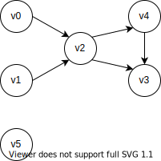
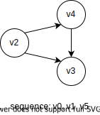
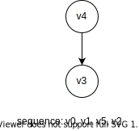

# 拓扑排序

## 简介
> 对一个有向无环图(Directed Acyclic Graph简称DAG)G进行拓扑排序，是将G中所有顶点排成一个线性序列，使得图中任意一对顶点u和v，若边<u,v>∈E(G)，则u在线性序列中出现在v之前。通常，这样的线性序列称为满足拓扑次序(Topological Order)的序列，简称拓扑序列。简单的说，由某个集合上的一个偏序得到该集合上的一个全序，这个操作称之为拓扑排序。

## 实现

拓扑排序只是要求从一个偏序得到该集合的一个全序，没有要求具体的实现，并且不同方法得到的全序不一定是一样的，但只要满足原本的偏序即可。

下面给出两种实现：

- DFS 逆序法
- 减一（删源）法

在给出具体的实现之前，先出计算顶点入度的算法

```cpp
//e is adjacent list
vector<int> getIndgrees(vector<vector<int>> const &e) {
  int n = e.size();
  vector<int> indegrees(n, 0);
	for(auto &vec: e)
		for(auto v: vec)
			++indegrees[v];
	return indegrees;
}
```

下面我们结合例子说名这两种算法是怎么实现的，例子的顶点图如下：



### 减一法

这种方法基于一个原理：即不断删除图中入度为零的顶点。可配合 BFS 进行遍历。

1. 找出所有入度为零的顶点
2. 删除图中入度为零的顶点以及从它们出发的边，同时将这些顶点放入输出序列
3. 图中的顶点数是否为零，否的话，重复步骤1、2

在图中，我们发现$v_0$、$v_1$和$v_5$这三个顶点的入度为零，我们把这三个顶点加入队列，将这些节点以及从它们出发的边删除，同时将这些顶点依次放入输出序列，得到下面的图。



我们继续寻找入度为零的节点，并将这些节点加入队列，即图中的$v_2$。我们很容易得出新的入度为零的顶点肯定是上一批被删除的顶点的邻接节点，因为将从它们出发的边删除，与其邻接的顶点才有可能入度为零。我们继续上面的操作，得到下面的图。



我们继续找出入度为零的顶点，即$v_3$，重复上面的操作，最后只剩一个入度为零的顶点$v_4$，继续重复上面的操作。

我们可以得到输出序列:$v_0, v_1, v_5, v_2, v_3, v_4$

在具体的实现中，我们可以配合 BFS 实现上诉描述，具体代码如下：

```cpp
vector<int> topological_sort_reduce(vector<vector<int>> const &e) {
	int n = e.size();
	vector<int> ret;
	auto indegrees = getIndgrees(e);
	
	queue<int> q;
	for(int v = 0; v < n; ++v)
		if(indegrees[v] == 0)
			q.push(v);
	while(q.size()) {
		auto v = q.front();
		q.pop();
		ret.push_back(v);
		for(auto val : e[v])
			if(--indegrees[val] == 0)
				q.push(val);
	}
	return ret;
}
```

上面的代码，没有判断图是否存在回路，为了判断图中是否存在回路。我们可以判断在执行删去入度为零的顶点后，图是否还存在顶点。

```cpp
vector<int> topological_sort_reduce_loop(vector<vector<int>> const &e) {
	int n = e.size();
	vector<int> ret;
	auto indegrees = getIndgrees(e);
	
	queue<int> q;
	for(int v = 0; v < n; ++v)
		if(indegrees[v] == 0)
			q.push(v);
	while(q.size()) {
		auto v = q.front();
		q.pop();
		ret.push_back(v);
		for(auto val : e[v])
			if(--indegrees[val] == 0)
				q.push(val);
	}
	return ret.size() == n ? ret : vector<int>();
}
```

### DFS 逆序法

该算法的原理是 DFS 回溯（或弹栈）的顶点顺序的逆序即是输出序列。

比较具体的描述如下

1. 找出所有入度为零的顶点，对其进行 DFS 遍历。
2. DFS每次回溯（弹栈的时候），将顶点加入结果数组。
3. 将结果数组倒序将得到我们要的顺序。

结合例子说明：在图中，我们依次对$v_0$、$v_1$和$v_5$这三个入度为零的顶点进行 DFS。我们先对顶点$v_0$进行 DFS，顶点的访问顺序是$v_0, v_2, v_3, v_4$，接着我们分别对$v_1$和$v_5$进行 DFS，由于其他节点都被访问过了，所以这两次顶点的 DFS 都只访问一个顶点，最后的顶点的访问顺序是$v_0, v_2, v_3, v_4, v_1, v_5$，将其逆序得到最终的序列$v_5, v_1, v_4, v_3, v_2, v_0$。

具体的代码如下

```cpp
void topological_sort_dfs_helper(int v, vector<vector<int>> const &e,  vector<bool> &vis, vector<int> &vec) {
	if(vis[v])
		return;
	vis[v] = true;
	for(auto val: e[v])
		topological_sort_dfs_helper(val, e, vis, vec);
	vec.push_back(v);
}
vector<int> topological_sort_dfs(vector<vector<int>> const &e) {
  int n = e.size();
	vector<bool> vis(n, false);
	vector<int> ret;
  //init inedgree
  auto indegrees = getIndgrees(e);
	for(int v = 0; v < n; ++v)
		if(indegrees[v] == 0)
			topological_sort_dfs_helper(v, e, vis, ret);
	reverse(ret.begin(), ret.end());
  return ret;
}
```

上面的代码，没有判断图是否存在回路，为了判断图中是否存在回路。我们可以判断在每一条DFS的路径，是否存在回路，为此引入`vector<bool> curPath`用来记录当前 DFS 路径访问过的节点。

```cpp
//return true when there is a loop
bool topological_sort_dfs_loop_helper(int v, vector<vector<int>> const &e, vector<bool> &vis, vector<int> &vec, vector<bool> &curPath) {
	if(curPath[v])
		return true;
	if(vis[v])
		return false;
	//visit the vertex v
	curPath[v] = true;
	vis[v] = true;
	for(auto val: e[v])
		if(topological_sort_dfs_loop_helper(val, e, vis, vec, curPath))
			return true;
	//backtracing
	curPath[v] = false;
	vec.push_back(v);
	return false;
}
vector<int> topological_sort_dfs_loop(vector<vector<int>> const &e) {
  int n = e.size();
	vector<bool> vis(n, false), curPath(n, false);
	vector<int> ret;
  //init inedgree
  auto indegrees = getIndgrees(e);
	for(int v = 0; v < n; ++v)
		if(indegrees[v] == 0)
			if(topological_sort_dfs_loop_helper(v, e, vis, ret, curPath))
				return vector<int>();
	reverse(ret.begin(), ret.end());
  return ret;
}
```

## 双向图

如果图是双向图的吧，需要将判断入度为 0 改为判断度为 1。

一道双向图的拓扑排序题目：[leetcode - 310. Minimum Height Trees]

（未完待续）

## 参考资料

- Anany Levitin《算法设计与分析》第三版
- [百度百科 拓扑排序](https://baike.baidu.com/item/拓扑排序)