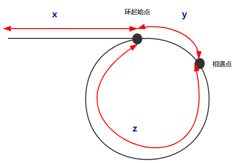
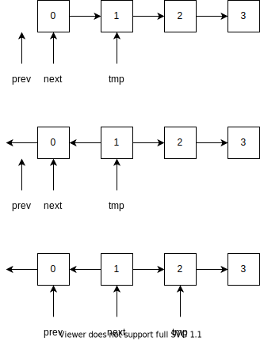
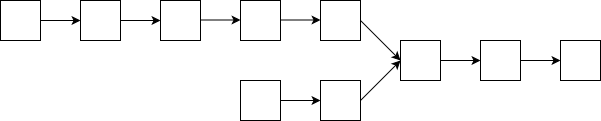
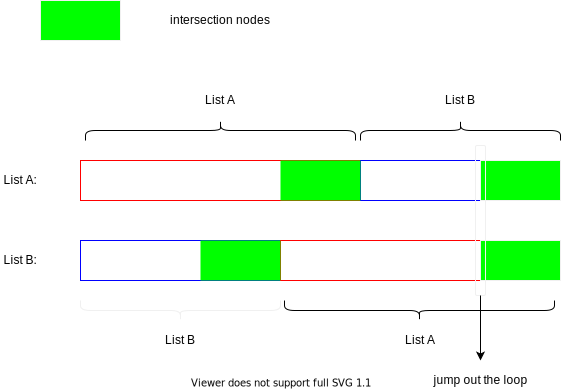

# 链表问题

总结一下常见的链表问题。

假设链表的结点定义如下：

```cpp
struct ListNode {
  int val;
  ListNode *next;
  ListNode() : val(0), next(nullptr) {}
  ListNode(int x) : val(x), next(nullptr) {}
  ListNode(int x, ListNode *next) : val(x), next(next) {}
};
```

## 逆序打印

```cpp
void linkedListReversePrint(ListNode *head) {
  if(head == nullptr)
    return;
  linkedListReversePrint(head -> next);
  cout << (head -> val) << ' ';
}
```

## 中间结点

给定一个带有头结点 head 的非空单链表，返回链表的中间结点。如果有两个中间结点，则返回第二个中间结点。

题目链接：[leetcode - 876. Middle of the Linked List](https://leetcode.com/problems/middle-of-the-linked-list/)

思路：设置两个指针，一个称为快指针，一个称为慢指针，并使它们都指向 head。快指针每次走两步，慢指针每次走一步。当快指针到达链表尾部（空指针）时，即走 $n - 1$ 步，慢指针走的步数为 $\lfloor \frac{n - 1}{2} \rfloor$。

```cpp
class Solution {
public:
  ListNode* middleNode(ListNode* head) {
    ListNode *fast = head, *slow = head;
    while(fast && (fast = fast -> next)) {
      fast = fast -> next;
      slow = slow -> next;
    }
    return slow;
  }
};
```

时间复杂度：$\Theta(n)$

## 倒数第 k 个结点

给定一个带有头结点 head 的非空单链表（结点数 >= k），返回链表倒数第 k 个结点。

思路：设置两个指针，一个快指针，一个慢指针，使得它们之间的步数差为 k，然后两个指针都一步步向前走，直至快指针到达尾部（空指针），此时满指针即是我们要的结点

```cpp
ListNode* lastKNode(ListNode *head, int k) {
  ListNode *fast = head, *slow = head;
  for(int i = 0; i < k; ++i)
    fast = fast -> next;
  while(fast) {
    fast = fast -> next;
    slow = slow -> next;
  }
  return slow;
}
```

时间复杂度：$\Theta(n)$

## 是否带环

给定一个链表，判断链表中是否有环。

题目链接：[leetcode - 141. Linked List Cycle](https://leetcode.com/problems/linked-list-cycle/)

思路：设置快慢指针，快指针每次走两步，慢指针每次走一步。由于快指针走得比慢指针快，如果存在环的话，快指针总会走到慢指针后面，并且快指针每次走两步，慢指针每次走一步，说明它们之间的距离不断减一，所以它们终会相遇。

```cpp
class Solution {
public:
  bool hasCycle(ListNode *head) {
  ListNode *fast = head, *slow = head;
  while(fast && ( fast = fast -> next ) ) {
    fast = fast -> next;
    slow = slow -> next;
    if(fast == slow)
      return true;
  }
  return false;
  }
};
```

时间复杂度：$\Theta(n)$

## 环起始点

给定一个链表，返回链表开始入环的第一个节点。如果链表无环，则返回 null。

题目链接：[leetcode - 142. Linked List Cycle II](https://leetcode.com/problems/linked-list-cycle-ii/)

设置快慢指针，快指针每次走两步，慢指针每次走一步，由上面可以知道，快慢指针肯定会相遇。我们很容易知道快慢指针肯定在圆圈内相遇，描述图如下。



相遇时

- slow 走的路程：$x + y + n(y + z), n \in Z^+$，$n$表示 slow 绕圆圈 n 圈才相遇
- fast 走的路程：$x + y + m(y + z), m > n, m \in Z^+$，$m$表示 fast 绕圆圈 m 圈才相遇

由于 fast 速度是 slow 两倍，故

$$
2\left[ x + y + n(y+z) \right] = x + y + m(y + z)
$$

化简得 $x = (m -2n)(y+z) -y$，令$k = m - 2n, k \in Z^+$，则 $ x = k(y + z) - y$

- 如果 $k = 1 \Rightarrow x = z$，即 head 到环起点的距离 = 从相遇点到环起点的距离。所以，我们令其中一个指针指向 head，然后两个指针同时往后走，再次相遇时即为环起点
- 如果 $k > 1, x = t(y+z)-y = (t-1)(y+z) + z$，即 x 的长度等于 o-1 圈加上 z。所以，我们令其中一个指针指向 head，然后两个指针同时往后走，再次相遇时即为环起点

```cpp
class Solution {
public:
  ListNode *detectCycle(ListNode *head) {
    ListNode *fast = head, *slow = head;
    while(fast != nullptr && ( fast = fast -> next ) != nullptr ) {
      fast = fast -> next;
      slow = slow -> next;
      if(fast == slow)
        break;
    }
    if(fast == nullptr)
      return nullptr;
    slow = head;
    while(slow != fast) {
      slow = slow -> next;
      fast = fast -> next;
    }
    return slow;
  }
};
```

## 反转链表

题目：反转一个单向链表

题目链接：[leetcode - 206. Reverse Linked List](https://leetcode.com/problems/reverse-linked-list/)

思路：



```cpp
class Solution {
public:
  ListNode* reverseList(ListNode* head) {
    if(head == nullptr)
      return head;
    ListNode *prev = nullptr, *next = head;
    while(next) {
      ListNode *tmp = next -> next;
      next -> next = prev;
      //update
      prev = next;
      next = tmp;
    }
    return prev;
  }
};
```

其他相关的题目

[25. Reverse Nodes in k-Group](https://leetcode.com/problems/reverse-nodes-in-k-group/)
[92. Reverse Linked List II](https://leetcode.com/problems/reverse-linked-list-ii/)

## 无环单链表相交

给定两个（单向）链表，判定它们是否相交并返回交点。若无相交，返回 null。

题目链接：[leetcode - 160. Intersection of Two Linked Lists](https://leetcode.com/problems/intersection-of-two-linked-lists/)

我们先看看两个无环单链表相交的情况，如下图所示。



如果它们存在相交的话，那么它们最后一个结点肯定是同一个结点，这是我们用来判断链表是否相交的根据。

如果我们知道两条链表的长度差 n，我们让长链表从头节点先走 n 步，然后让短链表从头节点一起走，它们相遇的点就是第一个相交点。

```cpp
class Solution {
public:
  ListNode *getIntersectionNode(ListNode *headA, ListNode *headB) {
    if(headA == nullptr || headB == nullptr)
      return nullptr;
    int nA = 1, nB = 1;// length of list
    //compute the length of list
    ListNode *tailA = headA, *tailB = headB; // tail is the last node of list
    while(tailA -> next) {
      tailA = tailA -> next;
      ++nA;
    }
    while(tailB -> next) {
      tailB = tailB -> next;
      ++nB;
    }
    //judge whether they intersect
    if(tailA != tailB)
      return nullptr;
    //get the intersection node
    int n; // n = abs(nA - nB)
    if(nA < nB) {
      n = nB - nA;
      swap(headA, headB); // make the list A the longest list
    } else
      n = nA - nB;
    for(int i = 0; i < n; ++i)
      headA = headA -> next;
    while(headA != headB) {
      headA = headA -> next;
      headB = headB -> next;
    }
    return headA;
  }
};
```

更佳优雅的写法

```cpp
class Solution {
public:
  ListNode *getIntersectionNode(ListNode *headA, ListNode *headB) {
    if(headA == nullptr || headB == nullptr)
      return nullptr;
    ListNode *pA = headA, *pB = headB;
    while(pA != pB) {
      pA == nullptr ? headB : pA -> next;
      pB == nullptr ? headA : pB -> next;
    }
    return pA;
  }
};
```

核心原理：A 和 B 两个链表长度可能不同，但是 A+B 和 B+A 的长度是相同的，所以遍历 A+B 和遍历 B+A 一定是同时结束。

在上面实现中，A 链表本质上在遍历 A B 序列，B 链表 在遍历 B A。

- 如果它们不存在相交的话，A 链表遍历完 A+B 后，B 链表刚好遍历完 B+A，且两者的值都为`nullptr`，故跳出循环
- 如果两个链表存在相交
	1. 如果两个链表的长度相等的话，很容易看出上面的代码会返回第一个相交的结点
	2. 如果两个链表长度不相等的话，下图容易看出，它们将会在第一个相交的结点跳出循环

