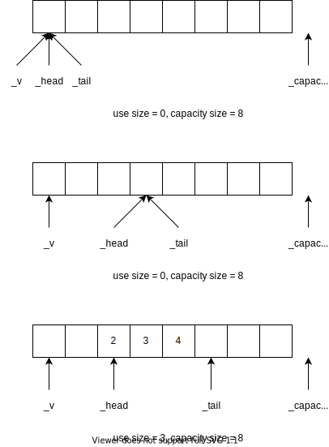

# 队列

队列是一种特殊的线性表，特殊之处在于它只允许在表的前端（front）进行删除操作，而在表的后端（rear）进行插入操作，和栈一样，队列是一种操作受限制的线性表。进行插入操作的端称为队尾，进行删除操作的端称为队头。

## ADT 接口

```cpp
template <typename T>
class Queue {
public:
  virtual ~Queue() {}
  virtual size_t size() const = 0;
  virtual T &front() = 0;
  virtual T &back() = 0;
  virtual void pop() = 0;
  virtual void push(T const&val) = 0;
};
```

## 顺序队列

顺序队列是一种在物理结构实现上为顺序存储的队列。

### 接口

```cpp
template <typename T>
class SequenceQueue: public Queue<T> {
protected:
  T *_v = nullptr, *_capacity = nullptr, *_head = nullptr, *_tail = nullptr;
  void expand();
  size_t capacity() const;
public:
  SequenceQueue();
  virtual ~SequenceQueue();
  size_t size() const;
  T& front();
  T& back();
  void pop();
  void push(T const &val);
};
```

### 存储结构

- `_v`：指向申请空间的第一个元素
- `_capacity`：指向申请空间的最后一个元素的下一个元素
- `_head`：指向队头
- `_tail`：指向队尾的下一个元素

- 申请空间为`[_v, _capacity)`，大小为`_capacity - _v`
- 使用空间为`[_head, _tail)`，大小为`_tail - _head`



### 具体实现

```cpp
template <typename T>
SequenceQueue<T>::SequenceQueue() {
  const int n = 16;
  _tail = _head = _v = new T[16];
  _capacity = _v + n;
}

template <typename T>
SequenceQueue<T>::~SequenceQueue() {
  delete[] _v;
}

template <typename T>
inline size_t SequenceQueue<T>::capacity() const {
  return _capacity - _v;
}

template <typename T>
inline size_t SequenceQueue<T>::size() const {
  return _tail - _head;
}

template <typename T>
void SequenceQueue<T>::pop() {
  if(_head == _tail)
    return;
  ++_head;
}

template <typename T>
T& SequenceQueue<T>::front() {
  return *_head;
}

template <typename T>
void SequenceQueue<T>::push(T const &val) {
  expand();
  *_tail++ = val;
}

template <typename T>
T& SequenceQueue<T>::back() {
  return *(_tail - 1);
}

template <typename T>
void SequenceQueue<T>::expand() {
  if(_tail != _capacity)
    return;
  size_t use_size = size();
  size_t capacity_size = capacity();
  if(use_size < capacity_size / 2) {
    //move the element
    copy(_head, _tail, _v);
    _head = _v;
    _tail = _head + use_size;
  } else {
    //malloc a new space
    size_t new_capacity = capacity_size * 2;
    T *new_v = new T[new_capacity];
    copy(_head, _tail, new_v);
    delete[] _v;
    _v = _head = new_v;
    _tail = _head + use_size;
    _capacity = _v + new_capacity;
  }
}
```

## 链式队列

