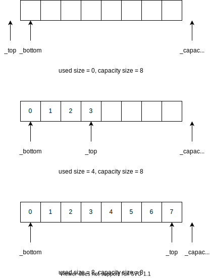
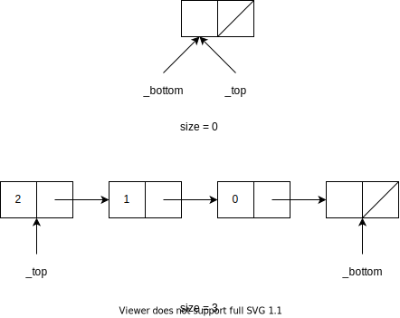
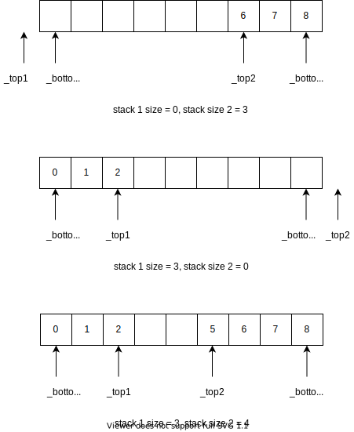

# 栈

栈（stack）是一种运算受限的线性表。限定仅在线性表的一端进行插入和删除操作，这一端被称为栈顶，相对地，把另一端称为栈底。向一个栈插入新元素又称作进栈、入栈或压栈，它是把新元素放到栈顶元素的上面，使之成为新的栈顶元素；从一个栈删除元素又称作出栈、退栈或弹栈，它是把栈顶元素删除掉，使其相邻的元素成为新的栈顶元素。

### ADT 接口

```cpp
template <typename T>
class Stack {
public:
  virtual ~Stack(){};
  virtual size_t size() const = 0;
  virtual T &top() = 0;
  virtual void pop() = 0;
  virtual void push(T const&) = 0;
};
```

## 顺序栈

顺序栈是一种在物理结构实现上为顺序存储的栈。

### 接口

```cpp
template <typename T>
class SequenceStack {
protected:
  T *_bottom = nullptr, *_top = nullptr, *_capacity = nullptr;
  size_t capacity() const;
  void expand();
public:
  SequenceStack();
  size_t size() const;
  T& top();
  void push(T const& val);
  void pop();
  virtual ~SequenceStack();
};
```

### 存储结构

- `_bottom`：指向栈底元素
- `_top`：指向栈顶元素
- `_capacity`：指向存储空间的最后一个元素的下一个元素

由此，我们可以得出

- 申请空间范围为`[_bottom, __capactiy)`，长度为`_capactiy - _bottom`
- 实际使用空间的范围为`[_bottom, _top]`，长度为`_top - _bottom + 1`



### 具体实现
```cpp
template <typename T>
size_t SequenceStack<T>::capacity() const {
  return _capacity - _bottom;
}

template <typename T>
size_t SequenceStack<T>::size() const {
  return _top - _bottom + 1;
}

template <typename T>
void SequenceStack<T>::expand() {
  if(_top + 1 != _capacity)
    return;
  size_t new_capacity = capacity() * 2;
  T *new_bottom = new T[new_capacity];
  copy(_bottom, _top + 1, new_bottom);
  //free
  delete[] _bottom;
  //update
  _capacity = new_bottom + new_capacity;
  _top = new_bottom + (_top - _bottom);
  _bottom = new_bottom;
}

template <typename T>
SequenceStack<T>::SequenceStack() {
  const int n = 16;
  _bottom = new T[n];
  _top = _bottom - 1;
  _capacity = _bottom + n;
}

template <typename T>
SequenceStack<T>::~SequenceStack() {
  delete[] _bottom;
}

template <typename T>
void SequenceStack<T>::push(T const &val) {
  expand();
  *(++_top) = val;
}

template <typename T>
void SequenceStack<T>::pop() {
  if(_top == _bottom - 1)
    return;
  --_top;
}

template <typename T>
T& SequenceStack<T>::top() {
  return *_top;
}
```

## 链栈

链栈是一种在物理结构实现上为链式存储的栈。

### 接口

```cpp
template <typename T>
class LinkStack: public Stack<T> {
protected:
  struct Node {
    T val;
    Node* next;
    Node(T const &v, Node *p = nullptr): val(v), next(p) {}
  };

  Node *_bottom = nullptr, *_top = nullptr;
  size_t _size;
public:
  LinkStack();
  virtual ~LinkStack();
  size_t size() const;
  T& top();
  void pop();
  void push(T const &val);
};
```

### 存储结构

- `_bottom`：指向栈底元素的下一个元素
- `_top`：指向栈顶元素
- `_size`：表示栈中元素的个数



为了方便实现，我们使用了一个空的节点，并将`_bottom`指向了它。

### 具体实现

```cpp
template <typename T>
LinkStack<T>::LinkStack() {
  _bottom = _top = new Node(T());
  _size = 0;
}

template <typename T>
LinkStack<T>::~LinkStack() {
 Node *tmp = nullptr;
 while(_top != _bottom) {
   tmp = _top -> next;
   delete _top;
   _top = tmp;
 }
 delete _bottom; 
}

template <typename T>
inline size_t LinkStack<T>::size() const {
  return _size;
}

template <typename T>
inline T& LinkStack<T>::top() {
  return _top -> val;
}

template <typename T>
void LinkStack<T>::pop() {
  if(_top == _bottom)
    return;
  Node *tmp = _top -> next;
  delete _top;
  _top = tmp;
  --_size;
}

template <typename T>
void LinkStack<T>::push(T const &val) {
  _top = new Node(val, _top);
  ++_size;
}
```

## 共享栈

利用栈底位置相对不变的特性，可让两个顺序栈共享一个一维数组空间，将两个栈的栈底分别设置在共享空间的两端，两个栈顶向共享空间的中间延伸，如下图所示。



## 单调栈