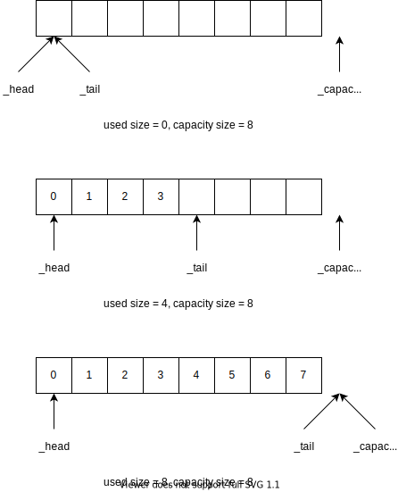

# 向量

向量是一种在数组的基础上实现可变空间存储的数据结构。

## 动态空间管理

实现可变空间的方法便是当申请的空间不够，我们重新申请一个更大同时可满足新的需求的空间，并将原来空间的数据复制到新空间去。

这样便会引出一个问题，新的空间，也就更大的空间，这个空间需要比原来大多少，大体上有如下两种方法。

1. 新的空间刚好满足需求
2. 新的空间比需求大一些

第一方法选择会导致不良后果，若申请刚好满足需求的空间，下次如果仅仅只需要再多申请一个元素的空间，那么还需要重新申请新的空间，将会导致申请空间和复制操作过于频繁。

第二种方法，难点就在于要大多少。一种方法是将原空间的大小不断乘以2，直至新的空间刚好满足需求。

下面分析申请两倍空间的分摊复杂度。

## 实现

### ADT 接口

```cpp
template <typename T>
class MyVector {
protected:
  T *_head = nullptr, *_tail = nullptr, *_capacity = nullptr;
  void expand(size_t new_need);
  
public:
  MyVector();
  MyVector(int n);
  MyVector(int n, T const &val);
  T& operator[](size_t);
  void push_back(T const &val);
  void pop_back();
  size_t size() const;
  size_t capacity() const;
  virtual ~MyVector();
};
```

### 存储结构

- `_head`：指向第一元素
- `_tail`：指向实际使用的最后一个元素的下一个元素
- `_capacity`：指向存储空间的最后一个元素的下一个元素

由此，我们可以得出

- 申请空间范围为`[_head, _capactiy)`，长度为`_capactiy - _head`
- 实际使用空间的范围为`[_head, _tail)`，长度为`_tail - _head`



```cpp
template <typename T>
inline size_t MyVector<T>::size() const {
  return _tail - _head;
}

template <typename T>
inline size_t MyVector<T>::capacity() const {
  return _capacity - _head;
}
```

### 扩展空间函数

```cpp
template <typename T>
void MyVector<T>::expand(size_t new_need) {
  size_t new_capacity = capacity();
  if(new_capacity >= new_need)
    return;
  while(new_capacity <= new_need)
    new_capacity <<= 1;
  T *new_head = new T[new_capacity];
  copy(_head, _tail, new_head);
  //free
  delete[] _head;
  //update
  _capacity = new_head + new_capacity;
  _tail = new_head + (_tail - _head);
  _head = new_head;
}
```

### 构造和虚构

```cpp
template <typename T>
MyVector<T>::MyVector() {
  const int n = 16;
  _tail = _head = new T[n];
  _capacity = _head + n;
}

template <typename T>
MyVector<T>::MyVector(int n) {
  _head = new T[n];
  _capacity = _tail = _head + n;
}

template <typename T>
MyVector<T>::MyVector(int n, T const &val): MyVector<T>(n) {
  fill(_head, _tail, val);
}

template <typename T>
MyVector<T>::~MyVector() {
  delete [] _head;
}
```

在默认构造函数`MyVector<T>::MyVector`默认了一个容量为16的大小，以免默认为0，起始阶段申请空间频繁。

### 操作函数

```cpp
template <typename T>
void MyVector<T>::push_back(T const &val) {
  expand(size() + 1);
  *_tail++ = val;
}

template <typename T>
void MyVector<T>::pop_back() {
  if(_tail == _head)
    return;
  --_tail;
}

template <typename T>
inline T& MyVector<T>::operator[](size_t i) {
  return _head[i];
}
```