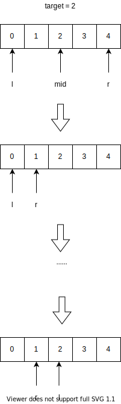
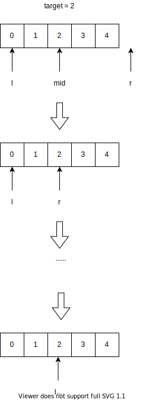
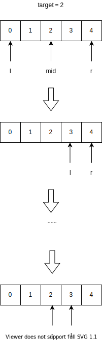

# 二分搜索

## 简介

二分查找也称为折半查找，其时间复杂度为$\Theta(\log n)$，它要求数据满足：

1. 元素有序排列
2. 元素可随机访问

其大致模板是

```cpp
int binarySearch(vector<int> &nums, int target) {
	int l = 0, r = /* ... */;
	while( /* condition */) {
		int mid = l +	(r - l) / 2;
		if(nums[mid] < target) {
			/* ... */
		} else if(nums[mid] == target) {
			l = /* ... */;
		} else if(nums[mid] > target) {
			r = /* ... */;
		}
	}
	return /* ... */;
}
```

代码说明：

1. 注释部分是我们需要填充的代码
2. 为了避免整数溢出，使用`mid = l + (r - l) / 2`，而不是`mid = (l + r) / 2`，当然这不是本文的重点。
3. 为了判断条件更为明显，最后一个分支使用`else if`，而不是`else`

为了简化说明，我们默认元素都是升序排列。

## 指定值搜素

### 区间 [l, r]

题目描述：给定某指定值`target`，在升序数组`nums`中查找该值的位置，若不存在则返回-1

如果看过其他的教程的话，我们可以不假思索地写下如下代码

```cpp
int binarySearch(vector<int> &nums, int target) {
	int l = 0, r = nums.size() - 1;
	while(l <= r) {
		int mid = l + (r - l) / 2;
		if(nums[mid] < target) {
			l = mid + 1;
		} else if(nums[mid] == target) {
			return mid;
		} else if(nums[mid] > target) {
			r = mid - 1;
		}
	}
	return -1;
}
```

几个注意点：

1. 必须是`r = nums.size() - 1`吗
2. 为什么是`while(l <= r)`
3. 如何设置`l`和`r`的更新

为了解决这几个注意点，我们必须先二分查找的思想，**二分查找本质上就是将搜索区间在排除已搜索过的值后将其划分为两个区间，选择其中一个区间继续搜索，从而达到搜索区间减半的效果**。

1. `r = nums.size() - 1`表明我们的搜索区间是$[l, r]$，并不一定是区间，下面还会说明区间$[l, r)$的写法。
2. 当搜索区间为空的时候，即`l`比`r`大的时候，和我们上面`while(l <= r)`想对应，也就是`while`刚好不成立的时候就是搜索空间刚好为空的时候。
3. 我们将搜索区间$[l, r]$划分为$[l, mid - 1]$和$[mid + 1, r]$，当`mid < target`的时候，说明`target`在`mid`的左边，也就是$[l, mid - 1]$，反之，我们的下一个搜索区间就是$[mid + 1, r]$，这也是我们更新`l`和`r`的原则。

### l, r 取值

其实，如果知道数组的元素和`target`，我们也可以知道最后`l`和`r`的值。二分搜素的目的是不断搜小搜索区间，比如某一次区间大小为$n$，下一次的区间大小就是$\lceil \cfrac{n}{2} \rceil$或$\lfloor \cfrac{n}{2} \rfloor$，如果一直没有找到`target`，区间就会被缩小成只有一个元素的区间。假设在上面的实现中，区间被缩小成$[x, x]$，我们只需要将该区间代入上面的`while`循环就可以知道最后`l`和`r`的值了。

1. 如果数组元素都小于`target`，那么区间肯定一直往右缩小，最后变成$[num.size() - 1, num.size() - 1]$，代入`while`循环后，我们就可以知道最后`l = nums.size(), r = nums.size() - 1`，符合跳出`while(l <= r)`的条件。
2. 如果数组元素都大于`target`，那么区间肯定一直往左缩小，最后变成$[0, 0]$，代入`while`循环后，我们就可以知道最后`l = 0, r = -1`，符合跳出`while(l <= r)`的条件。
3. 如果`nums`存在小于和大于`target`的元素，不存等于`target`的元素，最大的小于`target`的元素的下标为`x`，最小的大于`target`的元素的下标为`x+1`，那么最后`l = x + 1, r = x`，证明如下
	- 如果最后缩写到区间$[x, x]$，代入`while`得`l = x + 1, r = x`
	- 如果最后缩写到区间$[x + 1, x + 1]$，代入`while`得`l = x + 1, r = x`

### 区间 [l, r)

那我可以不可以将初始搜索空间设置$[0, nums.size())$，这当然是可以，但是需要变更一些代码，变更后的代码如下

```cpp
int binarySearch(vector<int> &nums, int target) {
	int l = 0, r = nums.size(); // attention
	while(l < r) { // attention
		int mid = l + (r - l) / 2;
		if(nums[mid] < target) { // attention
			l = mid + 1;
		} else if(nums[mid] == target) {
			return mid;
		} else if(nums[mid] > target) {
			r = mid; // attemtion
		}
	}
	return -1;
}
```

代码说明：

1. `while(l < r)`：由于我们的搜索区间是$[l, r)$，当搜索区间刚好为空的时候，即`r = l`，也就是`while(l < r)`刚好不成立的时候
2. `l = mid + 1`和`r = mid`：正如我们在上面说到的，二分查找本质上是将搜索区间划分为两个。我们将$[l, r)$划分为$[l, mid)$和$[mid + 1, r)$。若`nums[mid] < target`说明要搜索的值在`mid`左边，所以我们将`r`更新为`mid`，继而搜索$[l, mid)$；若`nums[mid] > target`说明要搜索的值在`mid`右边，所以我们将`l`更新为`mid + 1`，继而搜索$[mid + 1, r)$；

### l, r 取值

跟上面一样，我们也来分析一下最后`l`和`r`的取值。

1. 如果数组元素都小于`target`，区间一直往右缩小，最后变成$[num.size() - 1, nums.size())$，最后`l = r = nums.size()`。
2. 如果数组元素都大于`target`，区间一直往左缩小，最后变成$[0, 1)$，最后`l = r = 0`。
3. 如果`nums`存在小于和大于`target`的元素，不存等于`target`的元素，最大的小于`target`的元素的下标为`x`，最小的大于`target`的元素的下标为`x+1`，那么最后`l = x + 1, r = x`，证明如下
	- 如果最后缩写到区间$[x, x + 1)$，代入`while`得`l = r = x + 1`
	- 如果最后缩写到区间$[x + 1, x + 2)$，代入`while`得`l = r = x + 1`

## 左边界搜索

### 区间 [l, r]

我们似乎说完了二分查找，其实为之过早。上面的指定值查找的数组元素都是唯一的，那么如果要查找的元素的个数有多个呢？我们先看看下面的问题。

给定一个含有重复元素的升序数组以及一个元素`target`，你如何找到该元素第一次出现的位置，例如`array = {0, 0, 1, 2, 2, 2, 2, 3, 4}`和`target = 2`，正确答案便是`3`。

为了方便说明这个问题是如何实现，我们先给出实现代码，再讲解如何实现

```cpp
int binarySearchLeft(vector<int> &nums, int target) {
	int l = 0, r = nums.size() - 1;
	while(l <= r) {
		int mid = l + (r - l) / 2;
		if(nums[mid] < target) {
			l = mid + 1;
		} else if(nums[mid] == target) {
			r = mid - 1; // attention
		} else if(nums[mid] > target ) {
			r = mid - 1;
		}
	}
	return l == nums.size() || nums[l] != target ? -1 : l; //attention
}
```

我们将搜索区间$[l, r]$分成为$[l, mid - 1]$和$[mid + 1, r]$

代码说明

1. `nums[mid] == target`后的`r = mid -1`：因为我们要查找左边界，在我们找到`target`后，我们还要确定`mid`左边是否还有`target`，所以我们将`r`更新为`mid - 1`，继续搜索区间$[l, mid - 1]$。这也是算法能够搜索左边界的原因，找到`target`时不要⽴即返回，⽽是缩⼩搜索区间的上界，在 区间$[l, mid - 1]$中继续搜索，即不断向左收缩，达到锁定左侧边界的⽬的。
2. `l == nums.size() || nums[l] != target ? -1 : l`：这个可以结合`while(l <= r)`看，我们可以知道循环跳出时，`l`等于`r + 1`。
	1. 如果数组中存在`target`值，比如下面的图，当我们找到最左的`target`后还要往左缩进继续查找`target`，由于已经是最左的`target`了，所以在$[l, mid - 1]$肯定没有`target`，且该区间所有值都小于`target`，最后`r = mid, l = r + 1`，`l`的值就是最左`target`的位置，所以我们要`return l`。
	2. `nums`中数字都比`target`小的话，那么最后`l = nums.size(), r = nums.size() - 1`，这就是我们为什么判断`l == nums.size()`的原因。
	3. `nums`中数字都比`target`大的话，那么最后`r = 0, l = 1`，但是`l`并不是`target`的位置，所以我们要判断`nums[l] != target`
	4. 如果`nums`存在小于和大于`target`的元素，不存等于`target`的元素。设最大的小于`target`的元素的下标为`x`，从上面的推断方法中，我们很容易知道最后`l`等于`x+1`，所以我们要判断`nums[l] != target`



### 区间 [l, r)

如果将搜索区间设置为$[l, r)$，变更后的代码如下

```cpp
int binarySearchLeft(vector<int> &nums, int target) {
	int l = 0, r = nums.size(); // attention
	while (l < r) { // attention
		int mid = (l + r) / 2;
		if (nums[mid] < target) {
			l = mid + 1;
		} else if (nums[mid] == target) {
			r = mid; //attention
		} else if (nums[mid] > target) {
			r = mid; // attention
		}
	}
	return l == nums.size() || nums[l] != target ? -1 : l;
}
```
搜索区间$[l, r)$划分为$[l, mid)$和$[mid + 1, r)$

关于`l == nums.size() || nums[l] != target ? -1 : l`的说明

1. 如果数组中存在`target`值，比如下面的图，我们找到最左的`target`后还要往左缩进继续查找`target`，由于已经是最左的`target`了，所以在$[l, mid)$肯定没有`target`，且该区间所有值都小于`target`，最后`l = r = mid`，`l`的值就是最左`target`的位置，所以我们要`return l`。
2. `nums`中数字都比`target`小的话，那么最后`l = r = nums.size()`，这就是我们为什么判断`l == nums.size()`的原因。
3. `nums`中数字都比`target`大的话，最后`l = r = 0`，也就是说`l`并不是`target`的位置，所以我们要判断`nums[l] != target`
4. 如果`nums`存在小于和大于`target`的元素，不存等于`target`的元素。设最大的小于`target`的元素的下标为`x`，从上面的推断方法中，我们很容易知道最后`l`等于`x+1`，所以我们要判断`nums[l] != target`。



### 新的角度

我们从另一个角度看待左边界，由于数组的下标总是从0开始，那么`target`的下标同时也是数组中小于`target`的元素个数。我们可以猜想最后`l`的值就是数组中小于`target`的个数，为证明此猜想，我们只需要证明特殊情况，证明如下

1. 如果`nums`的元素都小于`target`，那么`l`最后就会等于`nums.size()`，`l`满足小于`target`的元素个数。
2. 如果`nums`的元素都大于`target`，那么`l`最后就会等于`0`，`l`满足小于`target`的元素个数。
3. 如果`nums`存在小于和大于`target`的元素，不存等于`target`的元素，记两者的下标为`x`和`x+1`
	- 如果最后缩写到区间$[x, x]$，代入`while`得`l = x + 1, r = x`，`l`满足小于`target`的元素个数。
	- 如果最后缩写到区间$[x + 1, x + 1]$，代入`while`得`l = x + 1, r = x`，`l`满足小于`target`的元素个数。

那么给定一个升序数组以及一个元素`target`，返回小于`target`的个数，其代码如下。

```cpp
int less_than(vector<int> &nums, int target) {
	int l = 0, r = nums.size() - 1;
	while(l <= r) {
		int mid = l + (r - l) / 2;
		if(nums[mid] < target) {
			l = mid + 1;
		} else if(nums[mid] == target) {
			r = mid - 1;
		} else if(nums[mid] > target ) {
			r = mid - 1;
		}
	}
	return l;
}
```

该特点对于使用$[l, r)$的实现也同样适用。

```cpp
int less_than(vector<int> &nums, int target) {
	int l = 0, r = nums.size(); // attention
	while (l < r) {
		int mid = (l + r) / 2;
		if (nums[mid] < target) {
			l = mid + 1;
		} else if (nums[mid] == target) {
			r = mid;
		} else if (nums[mid] > target) {
			r = mid;
		}
	}
	return l;
}
```

## 右边界搜素

### 区间 [l, r]

前面说了左边界搜索，那么相似的有右边界搜素。

给定一个含有重复元素的升序数组以及一个元素`target`，你如何找到该元素第一次出现的位置，例如`array = {0, 0, 1, 2, 2, 2, 2, 3, 4}`和`target = 2`，正确答案便是`6`。

当搜索区间为$[l ,r]$，我们的实现代码如下

```cpp
int binarySearchRight(vector<int> &nums, target) {
	int l = 0, r = nums.size() - 1;
	while(l <= r) {
		int mid = l + (r - l) / 2;
		if(nums[mid] < target) {
			l = mid + 1;
		} else if(nums[mid] == target) {
			l = mid + 1;
		} else if(nums[mid] > target) {
			r = mid - 1;
		}
	}
	return r < 0 || nums[r] != target ? - 1: r; // atention
}
```

在这里我们需要说明一下，为什么在[左边界搜索](#左边界搜索)，我们使用`l`来判断而在这里却使用`r`来判断。

1. 如果数组中存在`target`值，比如下面的图，我们找到最右的`target`后还要往右缩进继续查找`target`，由于已经是最右的`target`了，所以在$[mid + 1, r)$肯定没有`target`，最后`l = mid + 1，r = mid`，`r`的值就是最右`target`的位置，所以我们要`return r`。
2. `nums`里面的元素都小于`target`，最后`l = nums.size(), r = nums.size()-1`，所以我们要判断`nums[r] != target`
3. `nums`里面的元素都大于`target`，最后`l = 0, r = -1`，所以我们要判断`r < 0`
4. 如果`nums`存在小于和大于`target`的元素，不存等于`target`的元素。设最大的小于`target`的元素的下标为`x`，从上面的推断方法中，我们很容易知道最后`r`等于`x`。所以我们要判断`nums[l] != target`



### 区间 [l, r)

将搜索区间设置为$[l, r)$

```cpp
int binarySearchRight(vector<int> &nums, int target) {
	int l = 0, r = nums.size();
	while (l < r) {
		int mid = (l + r) / 2;
		if (nums[mid] < target) {
			l = mid + 1;
		} else if (nums[mid] == target) {
			l = mid + 1;
		} else if (nums[mid] > target) {
			r = mid;
		}
	}
	auto ret = r - 1; // attention
	return ret < 0 || nums[ret] != target ? -1 : ret; // attention
}
```

关于`auto ret = r - 1;return ret < 0 || nums[ret] != target ? -1 : ret;`的说明

1. 如果数组中存在`target`值，比如下面的图，我们找到最右的`target`后还要往右缩进继续查找`target`，由于已经是最右的`target`了，所以在$[mid + 1, r)$肯定没有`target`，最后`l = r = mid + 1`，`r - 1`的值就是最右`target`的位置，所以我们要`return r - 1`。
2. `nums`里面的元素都小于`target`，最后`l = r = nums.size()`，所以我们要判断`nums[r - 1] != target`
3. `nums`里面的元素都大于`target`，最后`l = r = 0`，所以我们要判断`r - 1 < 0`
4. 如果`nums`存在小于和大于`target`的元素，不存等于`target`的元素。设最大的小于`target`的元素的下标为`x`，从上面的推断方法中，我们很容易知道最后`l = r = x + 1`，我们要判断`nums[r - 1] != target`。


### 新的角度

最后，同样从另一个角度看到右边界的问题，`nums.size()`减去`target`的位置就是`nums`中大于`target`的元素的个数，其证明就不给出了，类似左边界的证明即可。

闭区间的实现代码：

```cpp
int greater_than(vector<int> &nums,int target) {
	int l = 0, r = nums.size() - 1;
	while(l <= r) {
		int mid = l + (r - l) / 2;
		if(nums[mid] < target) {
			l = mid + 1;
		} else if(nums[mid] == target) {
			l = mid + 1;
		} else if(nums[mid] > target) {
			r = mid - 1;
		}
	}
	if(r == -1)
		return nums.size();
	else if(r == nums.size() - 1 && nums[r] != target)
		return nums.size() - (r + 1);
	else
		return nums.size() - r;
}
```

特殊情况的证明

1. 数组中存在`target`，最后`r`等于最后一个`target`出现的位置，应该`return nums.size() - r`
2. 数组中元素都小于`target`，最后`r = nums.size() - 1`，应该`return nums.size() - (r + 1)`
3. 数组中元素都大于`target`，最后`r = - 1`，应该`return nums.size()`
4. 数组中存在小于和大于`target`的元素，不存在`target`元素。设最大的小于`target`的元素的下标为`x`，从上面的推断方法中，我们很容易知道最后`r`等于`x`。应该`return nums.size() - r`

开区间的实现代码

```cpp
int binarySearchRight2(vector<int> &nums, int target) {
	int l = 0, r = nums.size();
	while (l < r) {
		int mid = (l + r) / 2;
		if (nums[mid] < target) {
			l = mid + 1;
		} else if (nums[mid] == target) {
			l = mid + 1;
		} else if (nums[mid] > target) {
			r = mid;
		}
	}
	if(r == nums.size())
		return 0;
	else if(r == 0 && nums[0] != target)
		return nums.size();
	else
		return nums.size() - (r - 1);
}
```

特殊情况的证明

1. 数组中存在`target`，最后`r - 1`等于最后一个`target`出现的位置，应该`return nums.size() - (r - 1)`
2. 数组中元素都小于`target`，最后`r = nums.size()`，应该`return 0`
3. 数组中元素都大于`target`，最后`r = 0`，应该`return nums.size()`
4. 数组中存在小于和大于`target`的元素，不存在`target`元素。设最大的小于`target`的元素的下标为`x`，从上面的推断方法中，我们很容易知道最后`r`等于`x + 1`。应该`return nums.size() - (r - 1)`

## 代码总结

最后，总结并简化一下代码吧


### [l, r]区间

定值搜索

```cpp
int binarySearch(vector<int> &nums, int target) {
	int l = 0, r = nums.size() - 1;
	while(l <= r) {
		int mid = l + (r - l) / 2;
		if(nums[mid] < target) {
			l = mid + 1;
		} else if(nums[mid] == target) {
			return mid;
		} else {
			r = mid - 1;
		}
	}
	return -1;
}
```

左边界搜索

```cpp
int binarySearchLeft(vector<int> &nums, int target) {
	int l = 0, r = nums.size() - 1;
	while(l <= r) {
		int mid = l + (r - l) / 2;
		if(nums[mid] < target) {
			l = mid + 1;
		} else {
			r = mid - 1;
		}
	}
	return l == nums.size() || nums[l] != target ? -1 : l;
}
```

右边界搜素

```cpp
int binarySearchRight(vector<int> &nums, target) {
	int l = 0, r = nums.size() - 1;
	while(l <= r) {
		int mid = l + (r - l) / 2;
		if(nums[mid] <= target) {
			l = mid + 1;
		} else {
			r = mid - 1;
		}
	}
	return r < 0 || nums[r] != target ? - 1: r;
}
```

### [l, r)区间

定值搜索

```cpp
int binarySearch(vector<int> &nums, int target) {
	int l = 0, r = nums.size();
	while(l < r) {
		int mid = l + (r - l) / 2;
		if(nums[mid] < target) {
			l = mid + 1;
		} else if(nums[mid] == target) {
			return mid;
		} else {
			r = mid;
		}
	}
	return -1;
}
```

左边界搜索

```cpp
int binarySearchLeft(vector<int> &nums, int target) {
	int l = 0, r = nums.size();
	while (l < r) {
		int mid = (l + r) / 2;
		if (nums[mid] < target) {
			l = mid + 1;
		} else {
			r = mid;
		}
	}
	return l == nums.size() || nums[l] != target ? -1 : l;
}
```

右边界搜索

```cpp
int binarySearchRight(vector<int> &nums, int target) {
	int l = 0, r = nums.size();
	while (l < r) {
		int mid = (l + r) / 2;
		if (nums[mid] <= target) {
			l = mid + 1;
		} else {
			r = mid;
		}
	}
	auto ret = r - 1;
	return ret < 0 || nums[ret] != target ? -1 : ret;
}
```

## 参考资料
- [二分查找详解](https://labuladong.gitbook.io/algo/suan-fa-si-wei-xi-lie/er-fen-cha-zhao-xiang-jie)