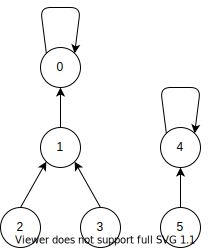
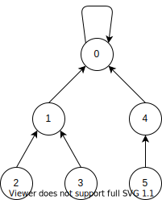
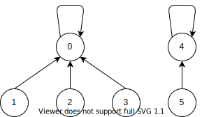

# 并查集

并查集（union find set）是一种维和集合的数据结构，它支持下面两个操作。

1. 查找：判断两个元素是否在同一个集合。
2. 合并：合并两个集合。

## 实现

并查集常见的实现是使用数组，例如我们给每一个元素一个id，这个id用自然数来表示（与数组下标相同），也就是说我们用一个自然数来表示一个元素。

我们先给出代码的大致框架。

```cpp
#include <vector>
using namespace std;
//union find set base
class UFSB {
protected:
  vector<int> father;
  int findRoot(int x);
public:
  UFSB(int n);
  bool isSameSet(int a, int b);
  void merge(int a, int b);
};
```

其中，`father[i]`表示元素i（i是id，下面不再指出）的父亲。我们利用这种树结构来边是一个集合，在同一个集合的元素具有一个共同的祖先，值得注意的是，若`father[i] = i`则表示元素i是这个集合的根元素。



例如在上面的图中，`int father[] = {0, 0, 1, 1, 4, 4}`，包含了两个集合。

## 初始化

最简单的初始化就是将每个元素都作为一个集合。

```cpp
UFSB::UFSB(int n): father(n) {
  for(int i = 0; i < n; ++i)
    father[i] = i;
}
```

## 查找

从图中看出，如何判断两个元素是否在同一个集合，只需要判断两个元素的根元素是否为同一个元素即可。下面给出查找某个元素的根元素的代码。

```cpp
int UFSB::findRoot(int x) {
  while(x != father[x])
    x = father[x];
  return x;
}
bool UFSB::isSameSet(int a, int b) {
  return findRoot(a) == findRoot(b);
}
```

## 合并

合并指的是两个集合合并为同一个集合。最简单的方法就是找出两个集合的根元素，然后把其中的一个根元素的father设置为另一个根元素。

例如，把上图的4指向0。



实现代码

```cpp
void UFSB::merge(int a, int b) {
  int rootA = findRoot(a),
      rootB = findRoot(b);
  if(rootA != rootB)
    father[rootB] = rootA;
}
```

## 优化

树的层越多，每次执行`findRoot`就会越久，最极端的情况下，也就是形成一个直链，其复杂度达到了$O(n)$。

最明显的优化便是采用路径压缩。也就是把每个元素直接指向它的根元素。例如我们可以把最开始的图优化成如下的图。



我们选择每次执行`findRoot`的时候就执行一个路径压缩，把查询的元素以及它所有的祖先都直接指向它的根元素。

```cpp
int UFSB::findRoot(int x) {
  int root = x;
  // the old findRoot
  while(root != father[root])
    root = father[root];
  //The second pass: let nodes point to root
  while(x != father[x]) {
    int tmp = father[x];
    father[x] = root;
    x = tmp;
  }
  return root;
}
```

## 扩展

在一开始，我们就是使用一个自然数来表示某个元素，但是在实际情况中，元素并不一定是自然数，这时候我们，我们只需要多一层映射就好，即元素实际的数据类型映射到整数。


```cpp
#include <map>
using namespace std;
//union find set
template <typename T>
class UFS: protected UFSB {
protected:
  map<T, int> elem2id;
public:
  UFS(): UFSB(0) {}
  bool insert(T const &elem) {
    if(elem2id.count(elem))
      return false;
    int id = father.size();
    elem2id[elem] = id;
    father.push_back(id);
    return true;
  }
  bool isSameSet(T const &a, T const &b) {
    return UFSB::isSameSet(elem2id[a], elem2id[b]);
  }
  void merge(T const&a, T const&b) {
    UFSB::merge(elem2id[a], elem2id[b]);
  }
};
```