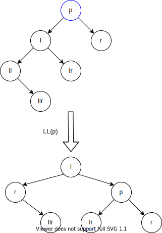
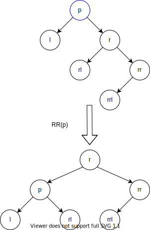
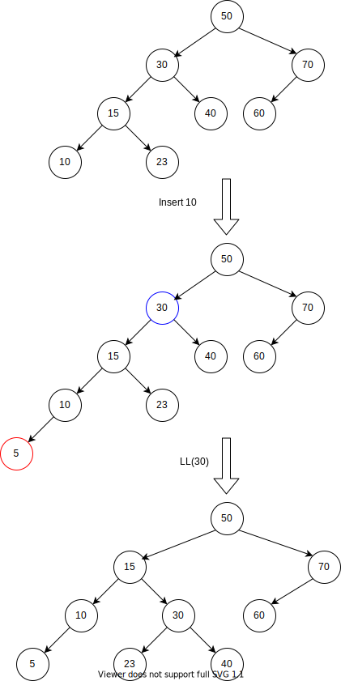
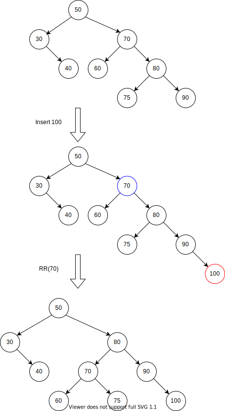
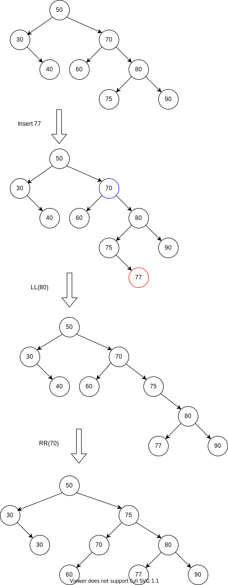

# AVL 树

AVL树也称为平衡二叉查找树、高度平衡树，以其发明者 - 前苏联两位数学家G.M.**A**delse-**V**elskil和E.M.**L**andis的名字命名。

首先给出高度的定义：节点到其后代的空节点的距离的最大值。
下图是对节点用其高度进行标志


AVL树的定义：
1. AVL树是一棵二分搜索树（binary search tree）
2. 任何一个节点的左右子树的高度差最大为1（|height(left subtree) - height(right subtree) < 1|）（也称为树是平衡的）。

AVL树的例子

蓝色节点的高度不满足条件。

## 代码概况
### 节点定义
```cpp
template <typename K, typename V>
struct Node {
  K k; //key
  V v; //value
  int h; //height
  Node<K, V> *lc, *rc;
  Node(K const &key, V const &val, Node<K, V> *plc = nullptr, Node<K, V> * prc = nullptr): k(key), v(val), h(1), lc(plc), rc(prc) {}
  //update height
  void updateH() {
    h = .drawio.svgmax( lc ? lc -> h : 0, rc ? rc -> h : 0) + 1;
  }
  //get balance factor
  int getBF() const {
    return (lc ? lc -> h : 0) - (rc ? rc -> h : 0);
  }
};
```

这里`getBF`就不返回绝对值了，为了可以通过判断返回值的正负来判断左右子树谁比较高。

### 代码框架
由于`AVL Tree`本身也是一棵`Binary Search Tree`，只是在操作`insert`和`remove`的会调整树（子树）的高度，使其满足定义。

下面将它与`Binary Search Tree`的相同代码列出来。

```cpp
template <typename K, typename V>
class BST {
public:
  Node<K, V> const * search(K const &k) const {
    return search(k, _root);
  };
  void insert(K const &k, V const &v) {
    return insert(k, v, _root);
  }
  bool remove(K const &k) {
    return remove(k, _root);
  }
  ~BST() {
    destory(_root);
  }
private:
  Node<K, V> *_root = nullptr;
  int _size = 0;
  //create a node
  Node<K, V>* malloc(K const &k, V const &v) {
    ++_size;
    return new Node<K, V>(k, v);
  }
  //free a node
  void free(Node<K, V> * node) {
    delete node;
    if(--_size == 0)
      _root = nullptr;
  }
  //free the tree rooted at `root`
  void destory(Node<K, V> *root) {
    if(root == nullptr)
      return;
    destory(root -> lc);
    destory(root -> rc);
    free(root);  
  }
  //search
  Node<K, V> const * search(K const &k, Node<K, V> *root) const {
    if(root == nullptr)
      return nullptr;
    else if(k < root -> k)
      return search(k, root -> lc);
    else if(k == root -> k)
      return root;
    else
      return search(k, root -> rc);    
  }
};
```

### 辅助函数
```cpp
template <typename K, typename T>
class AVLT {
private:
  static int getHeight(Node<K, V> const *node) {
    return node == nullptr ? 0 : node -> h;
  }
};
```

为了不将该函数放在`Node<K, V>`成员函数里面，因为我们都是使用`Node<K, V>*`来获取`Node<K, V>`的高度，而指针可能为`nullptr`，所以放在`AVLT`里面比较适合。

## 旋转
AVL本身也是一棵二分搜索树，但是它比二分搜索树多了对了高度的要求，也就是要求我们在插入和删除后（跟二分搜索树一样的插入与删除），要保证节点的高度依旧满足条件，可以通过旋转来达到目的。

在下面的图中，为了方便，我们假设所有节点满足大小关系，使用字母来表示节点，Tree(字母)表示以某节点为根的树，如`p`表示节点`p`，`tree(p)`表示以`p`为根的树。

### LL
下图中，`p`的高度不满足平衡，需要进行旋转。



条件：
1. 不平衡节点（`p`）的左子树比（**L**）（`tree(l)`）比右子树（`tree(r)`）高
2. 不平衡节点的左子树的左子树（**L**）（`tree(ll)`）比其右子树（`tree(lr)`）高

旋转：左子树的根节点（`l`）变成新的根节点，左子树的右子树（`tree(lr)`）变成原来根节点（`p`）的左子树

旋转的记忆法：因为左子树比较高，左子树的根（`l`）作为根节点，原根节点（`p`）与新根节点（`l`）相对位置不变（原根节点是新根节点的右孩子）。原根节点失去左子树（即`tree(l)`），拿原左子树的右子树（`tree(lr)`）当自己的左子树。

特点：只有`p`和`l`这两个节点的高度发生了变化

代码：
```cpp
void ll(Node<K, V>* &root) {
  auto p = root,
        l = p -> lc, //left subtree
        lr = l -> rc;   //right subtree of l
  //rotation
  p -> lc = lr;
  l -> rc = root;
  root = l; //update the root
  //update height
  p -> updateH();
  l -> updateH();
}
```

### RR
下图中，`p`的高度不满足平衡，需要进行旋转。



条件：
1. 不平衡节点（`p`）的右子树比（**R**）（`tree(r)`）比左子树（`tree(l)`）高
2. 不平衡节点的右子树的右子树（**R**）（`tree(rr)`）比其左子树（`tree(rl)`）高


旋转：右子树的根节点（`r`）变成新的根节点，右子树的左子树（`tree(rl)`）变成原来根节点（`p`）的右子树

旋转的记忆法：因为右子树比较高，右子树的根（`r`）作为根节点，原根节点（`p`）与新根节点（`r`）相对位置不变（原根节点是新根节点的左孩子）。原根节点失去右子树（即`tree(r)`），拿原右子树的左子树（`tree(rl)`）当自己的右子树。

特点：只有`p`和`r`这两个节点的高度发生了变化

代码：
```cpp
void rr(Node<K, V>* &root) {
  auto p = root,
        r = p -> rc,
        rl = r -> lc;
  //rotation
  p -> rc = rl;
  r -> lc = p;
  root = r; //update the root
  //update height
  p -> updateH();
  r -> updateH();
}
```

### LR
下图中，`p`的高度不满足平衡，需要进行旋转。


条件：
1. 不平衡节点（`p`）的左子树比（**L**）（`tree(l)`）比右子树（`tree(r)`）高
2. 不平衡节点的左子树的右子树（**R**）（`tree(lr)`）比其左子树（`tree(ll)`）高

旋转：对不平衡节点的左子树进行RR旋转，对不平衡节点进行LL旋转。

代码：
```cpp
void lr(Node<K, V>* &root) {
  rr(root->lc);
  ll(root);
}
```

### RL
下图中，`p`的高度不满足平衡，需要进行旋转。


条件：
1. 不平衡节点（`p`）的右子树比（**R**）（`tree(r)`）比左子树（`tree(l)`）高
2. 不平衡节点的右子树的左子树（**L**）（`tree(rl)`）比其右子树（`tree(rr)`）高

旋转：对不平衡节点的右子树进行LL旋转，对不平衡节点进行RR旋转。

代码：
```cpp
void rl(Node<K, V>* &root) {
  ll(root->rc);
  rr(root);
}
```

## 插入
步骤：
1. 按照二分搜索树的插入进行插入。
2. 从插入节点开始向上回溯，找到第一个不平衡节点，进行旋转。

技巧：假设现在我们直到不平衡节点的左子树比右子树高的话，我们要进行的旋转就是LL或者LR，因为插入了这个节点，使得不平衡节点的左右子树高度不一样，如果插入节点的值比左子树的根值小的话，我们就可以确定不平衡节点的左子树的高度比其右子树大，我们要进行的旋转就是LL，而不是LR。

### LL 示例


在上面的例子中，插入节点`5`，使得树变得不平衡（例如，`30`和`50`两个节点都不满足左右子树高度差小于等于1），我们从插入节点开始往上找，直到第一个不平衡节点`30`，由于`5 < 30`，根据上面的技巧，进行LL旋转。

### RR示例


在上面的例子中，插入节点`100`，使得树变得不平衡（例如，`70`和`50`两个节点都不满足左右子树高度差小于等于1），我们从插入节点开始往上找，直到第一个不平衡节点`70`，由于`100 > 70`，根据上面的技巧，进行RR旋转。

### LR示例


在上面的例子中，插入节点`17`，使得树变得不平衡（例如，`70`和`50`两个节点都不满足左右子树高度差小于等于1），我们从插入节点开始往上找，直到第一个不平衡节点`70`，由于`17 < 30`，根据上面的技巧，进行LR旋转。

### RL示例


在上面的例子中，插入节点`77`，使得树变得不平衡（例如，`70`和`50`两个节点都不满足左右子树高度差小于等于1），我们从插入节点开始往上找，直到第一个不平衡节点`70`，由于`77 > 70`，根据上面的技巧，进行LR旋转。


### 实现代码
```cpp
void insert(K const &k, V const &v, Node<K, V>* &root) {
  if(root == nullptr) {
    root = new Node<K, V>(k,v);
  } else if(k < root -> k) {
    insert(k, v, root -> lc);
    if(root -> getBF() == 2) {
      if(k < root -> lc -> v)
        ll(root);
      else
        lr(root);
    } else {
      root -> updateH();
    }
  } else if(k == root -> k) {
    root -> v = v;
  } else {
    insert(k, v, root -> rc);
    if(root -> getBF() == -2) {
      if(k > root -> rc -> v)
        rr(root);
      else
        rl(root);
    } else {
      root -> updateH();
    }
  }
}
```

为什么判断的是`getBF() == 2`（`getBF() == -2`）而不是`abs(getBF()) > 1`？
因为在插入之前，以root为根的树是高度平衡，若插入在左子树，如果使得树变得不平衡，肯定是左子树刚好比右子树高导致的。

为什么`root -> updateH()`只在`getBF()`判断高度不平衡时调用？
因为不平衡时会调用各种旋转函数，如`ll`等，这些函数会调用`root -> updateH()`，对新老的`root`进行高度调整。

为什么`updateH()`函数仅仅用到直接链接的左右孩子的高度，而不是全部后代综合起来考虑，例如下面的代码（这个问题换个问法，就是在插入的过程中，如何保证获取到的左右子树的高度是正确的）。
```cpp
template <typename K, typename V>
struct Node {
  void updateH() {
    h = .drawio.svgmax(calcH(lc), calcH(rc)) + 1;
  }
  static int calcH(Node<K, V> *root) {
    if(root == nullptr)
      return 0;
    return .drawio.svgmax(root -> lc, root -> rc) + 1;
  }
};
```
在实现插入的代码中，每一次调用自己（递归）当作一个向下的搜索，每一次弹栈（完成一次递归）当作一个向上的回溯。
下面利用“数学归纳法”来证明子树的高度是正确的。
1. 第一次插入节点，所有节点（也就一个节点）的高度的是正确。
2. 假设插入若干次后，我们形成了一棵AVL树，如下图所示。
3. 现在我们插入一个节点`5`，其函数调用图如下图所示，从图中可以看出每一次`updateH`，其子树的高度都是正确的（嗯，这一步虽然没有考虑到其他情况，但是其他情况也是这样的，不知道怎么表达）。


## 删除
删除操作跟二分搜索树有点类似，需要要左子树的最大节点或者右子树的最小节点去替换删除的节点，然后我们还要保证平衡，这需要通过旋转来达到。

### 移除最大最小节点
先给出移除最大节点和最小节点的代码。
```cpp
Node<K, V>* const removeMax(Node<K, V>* &root) {
  if(root -> rc != nullptr) {
    auto ret = removeMax(root -> rc);
    root -> updateH();
    return ret;
  } else {
    auto ret = root;
    root = root -> lc;
    return ret;
  }
}
Node<K, V>* const removeMin(Node<K, V>* &root) {
  if(root -> lc != nullptr) {
    auto ret = removeMin(root -> lc);
    root -> updateH();
    return ret;
  } else {
    auto ret = root;
    root = root -> rc;
    return ret;
  }
}
```
调用示意图如下：


### 实现
最后给出`remove`的完整代码
```cpp
bool remove(K const &k, Node<K, V>* &root) {
  if(root == nullptr) {
    return false;
  } else if(k < root -> k) {
    auto ret =  remove(k, root -> lc);
    if(ret == false)
      return ret;
    if(root -> getBF() == -2) {
      auto r = root -> rc;
      (getHeight(r -> lc) > getHeight(r -> rc)) ? rl(root) : rr(root);
    }
  } else if(root -> k < k) {
    auto ret = remove(k, root -> rc);
    if(ret == false)
      return ret;
    if(root -> getBF() == 2) {
      auto l = root -> lc;
      (getHeight(l -> lc) > getHeight(l -> rc)) ? ll(root) : lr(root);
    }
  } else {
    auto tmp = root,
          l = root -> lc,
          r = root -> rc;
    if(l && r) /*both left and right tree are not empty */{
      auto node = (l -> h > r -> h) ? removeMax(l) : removeMin(r);
      node -> lc = root -> lc;
      node -> rc = root -> rc;
      root = node;
    } else /* more than one subtree are empty */{
      root = l ? l : r;
    }
    this -> free(tmp);
  }
  if(root != nullptr)
    root -> updateH();
  return true;
}
```
调用示意图：


关于`remove`中旋转函数的调用问题，参考前面对旋转中的条件即可。

而二分搜索树不同的是，二分搜索树随意选择左子树的最大节点或者右子树的最小节点，但是在AVL树中，我们选择高度小的子树，这样可以减少左右子树的高度差，使得比较平衡。因为这样移除最大或者最小节点后。不会使得以删除节点为根的树变得不平衡，也就可以减少旋转的次数。