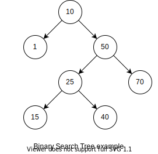
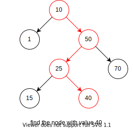
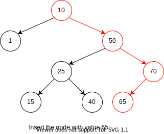
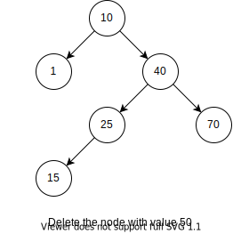
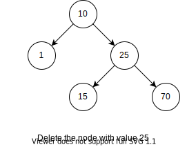

# 二分搜索树

递归定义：
1. 要么二分搜索树是空树
2. 要么二分搜索树由根节点、左右子树构成。其中左右子树都是二分搜索树，且左子树所有节点值小于根节点值，根节点值小于右子树所有节点值。



由于之前打算重新学一遍”树惧“结构，所以以最简单`binary search tree`作为树型结构的开始吧。

下面将代码根据功能进行拆分，加上相应的解读，最后再给出完整代码，方便以后查阅。

## 代码概况
### 节点定义
```cpp
template <typename K, typename V>
struct Node {
  K k; //key
  V v; //value
  Node<K, V> *lc, *rc; //left children, right children
  Node(K const &k, V const & v, Node<K, V> *plc = nullptr, Node<K, V> *prc = nullptr): k(k), v(v), lc(prc), rc(prc){}
};
```

### 基本操作
二分搜索树的基本操作包括`search`、`insert`和`remove`。
```cpp
template <typename K, typename V>
class BST {
public:
  Node<K, V> const * search(K const &k) const;
  void insert(K const &k, V const &v);
  bool remove(K const &k);
};
```
注意：`search`的返回值是指针，是为了方便搜索不到的时候的返回值（这时候应该返回`nullptr`），这有点类似`STL`的设计。

### 存储结构
我们只需要两个变量：`_root`和`_size`。
```cpp
template <typename K, typename V>
class BST {
private:
  Node<K, V> *_root = nullptr;
  int _size = 0;
};
```

- `_root`：用来储存树的根
- `_size`：用来表示树的节点数目，以便当我们删除完所有节点的时候，将`_root`设置为`nullptr`

### 节点的创建与销毁
树型结构，我采用了传统的实现方式，即用`new`（创建节点）和`delete`（销毁节点）。
```cpp
template <typename K, typename V>
class BST {
public:
  ~BST() {
    destory(_root);
  }
private:
  //create a node
  Node<K, V>* malloc(K const &k, V const &v) {
    ++_size;
    return new Node<K, V>(k, v);
  }
  //free a node
  void free(Node<K, V> * node) {
    delete node;
    if(--_size == 0)
      _root = nullptr;
  }
  //free the tree rooted at `root`
  void destory(Node<K, V> *root) {
    if(root == nullptr)
      return;
    destory(root -> lc);
    destory(root -> rc);
    free(root);  
  }
};
```

## 搜索
这大概是二叉树最简单的部分，一直沿着树根向下，直到找到符合的节点（搜索成功）或者到达空节点（搜索失败）。

示例：查找值为`40`的节点，路径如红色所示



```cpp
template <typename K, typename V>
class BST {
public:
  Node<K, V> const * search() const {
    return search(_root);
  }
private:
  Node<K, V> const * search(K const &k, Node<K, V> *root) const {
    if(root == nullptr)
      return nullptr;
    else if(k < root -> k)
      return search(k, root -> lc);
    else if(k == root -> k)
      return root;
    else
      return search(k, root -> rc);    
  }
};
```
## 插入
插入与搜索类似，从树的根部一直往下，直到到达一个空节点或值符合的节点，把值插在这个节点。

示例：插入值为`65`的节点，路径如红色所示。


```cpp
template <typename K, typename V>
class BST {
public:
  void insert(K const &k, V const &v) {
    insert(k, v, _root);
  };
private:
  void insert(K const &k, V const &v, Node<K, V>* &root) {
    if(root == nullptr)
      root = this->malloc(k, v);
    else if(k < root -> k)
      insert(k, v, root -> lc);
    else if(k == root -> k)
      root -> v = v;
    else
      insert(k, v, root -> rc);
  }
};
```

## 删除
步骤：
1. 找到符合的节点，若没有则删除失败
2. 将该节点的左子树的最大节点（右子树的最小节点）删除，并用最大节点（最小节点）的值替换要删除的节点的值。

对于第二步，为什么替换后，该树依旧保持二分搜索树的性质呢？
答：从大小上看，左子树的非最大节点 < 左子树的最大节点 < 根节点 < 右子树所有节点，所以用左子树的最大节点替换根节点后，新的子树依旧满足，新的左子树所有节点（左子树的非最大节点） < 新的根节点（左子树的最大节点） < 新的右子树（原来的右子树）。至于对删除节点的父节点（以及祖辈们），它们与新的子树关系没有变化，因为新的子树所有节点本来就满足与删除节点的父节点之间的大小关系。右子树的最小节点类比一下即可证明。

示例：删除值为`50`的节点（使用左子树的最大节点去代替）


如果不存在左子树的最大节点（右子树的最小节点），也就是左子树不存在右子树（右子树不存在左子树），简单地将该点删除即可。

示例：删除值为`40`的节点（在删除`50`的基础上）


```cpp
template <typename K, typename V>
class BST {
public:
  bool remove(K const &k) {
    return remove(k, _root);
  };
private:
  //remove the max node from tree, and return the node
  Node<K, V>* removeMax(Node<K, V>* &root) {
    if(root -> rc != nullptr) {
      return removeMax(root -> rc);
    } else {
      auto ret = root;
      root = root -> lc;
      return ret;
    }
  }
  bool remove(K const &k, Node<K, V>* &root) {
    if(root == nullptr) {
      return false;
    } else if(k < root -> k) {
      return remove(k, root -> lc);
    } else if(root -> k < k) {
      return remove(k, root -> rc);
    } else {
      auto tmp = root;
      if(root -> lc == nullptr) /* There is no left subtree of root */ {
        root = root -> rc;
      } else /* replace the node wiht max node of left subtree */ {
        auto maxNode = removeMax(root -> lc);
        maxNode -> lc = root -> lc;
        maxNode -> rc = root -> rc;
        root = maxNode;
      }
      this -> free(tmp);
      return true;
    }
  }
};
```

## 示例

### 感悟

写写感悟吧，不得不说对于树型结构，还是使用递归写起来熟悉和快一点，下午本来想写个非递归版，在`remove`，`removeMax`和`insert`这三个函数中，需要不断维护两个指针，即父指针和待操作的节点的指针（在`remove`中为被删除的节点的指针，在`removeMax`是最大值的节点的指针，`insert`是待插入的节点的指针）。

其实，`insert`可以只维护一个指针，不需要父指针，但是需要二级指针，代码如下。
```cpp
void insert(K const &k, V const &v) {
  Node<K, V>* *curRootPtr = &_root;
  while(*curRootPtr != nullptr) {
    if(k < (*curRootPtr)->k)
      curRootPtr = &((*curRootPtr) -> lc);
    else if(k == (*curRootPtr)->k) {
      (*curRootPtr) -> v = v;
      return;
    } else
      curRootPtr = &((*curRootPtr) -> rc);
  }
  *curRootPtr = this->malloc(k, v);
}
```

不得不说，在递归中使用`*&`（注意代码中的`*&`），减少了父指针，是一种明智的选择！！