# 左倾堆

## 简介

左倾堆又被称为最左堆、左式堆、左偏树。

它与二叉堆的相同点

- 它也是一棵二叉树
- 它具有获取堆顶元素、删除堆顶元素、插入新的元素这三个基本操作
- 结点在链接上具有二叉堆一样的最小堆或最大堆的特点

为了介绍的方面，我们默认左倾堆都是最小堆的特性，即父节点的值小于孩子节点的

与二叉堆的不同点

- 它不再是一棵完全二叉树，而且是一棵极不平衡的树
- 它是一种可并堆（mergeable heap），能够快速合并两个堆

从上面可以看到，左倾堆与二叉堆最大的不同是：左倾堆可以进行快速合并。当然二叉堆也可以进行合并，将其中一个二叉堆的元素依次插入另一个二叉堆即可。

为了实现快速合并操作，我们需要引入几个概念

- 外节点：当且仅当节点 i 的左子树或右子树为空时，节点被称作外节点
- npl(null path length) 属性：有些英文资料称为 s-value。节点i的 npl 值是节点 i 到其后代中的外界点的最短距离（距离可以看作是边的个数）。为了方便计算，规定外界点的 npl 为0，而空节点的 npl 为 -1。

左偏树满足如下的左偏性质（Leftist Property）∶任意结点的左子结点的 npl 不小于右子结点的 npl。

由左偏性质可知，一个结点的 npl 等于以该结点为根的子树最右路径的长度。所以，可以得到如下的左偏树定理∶若一棵左偏树有 n 个结点，则该左偏树的距离不超过 $\lfloor \log_2(n+1) \rfloor - 1$。

如下图所示，显示一棵左倾堆，节点旁边的数字表示该节点的 npl，红色部分是根节点的最右路径长度即为左倾堆的 npl。

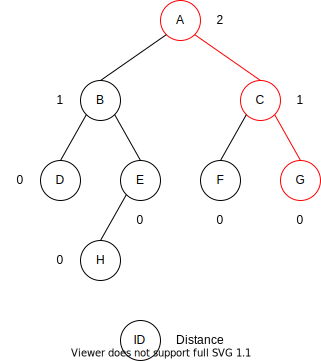

## API

下面给出其基本的实现代码

```cpp
template <typename T>
struct Node {
  T k;
  int npl = 0;
  Node<T> *lc, *rc;
  Node(T const & key, Node<T> *plc = nullptr, Node<T> *prc = nullptr): k(key), lc(plc), rc(prc) {}
};

template <typename T>
class LeftistHeap {
protected:
  Node<T> *root = nullptr;
  static Node<T>* merge(Node<T> *x, Node<T> *y);
  static void free(Node<T> *p);
public:
  void merge(LeftistHeap<T> &tree);
  void insert(T const &val);
  void remove();
  LeftistHeap(){}
  LeftistHeap(vector<T> const &v);
  ~LeftistHeap();
};
```

```cpp
template <typename T>
void LeftistHeap<T>::free(Node<T> *p) {
  if(p == nullptr)
    return;
  free(p -> lc);
  free(p -> rc);
  delete p;
}

template <typename T>
LeftistHeap<T>::~LeftistHeap() {
  free(root);
}
```

## 合并

合并两个两个左倾堆的基本思想如下：

1. 如果一个空左倾堆与一个非空左倾堆合并，返回非空左倾堆。
2. 如果两个左倾堆都非空，那么比较两个根节点，取较小堆的根节点为新的根节点。将"较小堆的根节点的右孩子"和"较大堆"进行合并。
3. 如果新堆的右孩子的 npl > 左孩子的 npl，则交换左右孩子。
4. 设置新堆的根节点的 npl = 右孩子 npl + 1

其伪代码如下

```
function merge(x, y)
  if x = none
    return y
  if y = none
    return x
  if x.key > y.key
    swap(x, y)
  x.rc <- merge(x.rc, y)
  if x.rc.npl > x.lc.npl
    swap(x.rc, y.lc)
  x.npl <- x.rc.npl + 1
```

实现代码

```cpp
template <typename T>
Node<T>* LeftistHeap<T>::merge(Node<T> *x, Node<T> *y) {
  if(x == nullptr)
    return y;
  if(y == nullptr)
    return x;
  if(x -> k > y -> k)
    swap(x, y);
  Node<T>* &xr = x -> rc, * &xl = x -> lc;
  xr = merge(xr, y); // xr must not be nullptr after this operation
  if(xl == nullptr || xr -> npl > xl -> npl)
    swap(xr, xl);
  x -> npl = xr ? xr -> npl + 1 : 0;
  return x;
}

template <typename T>
void LeftistHeap<T>::merge(LeftistHeap<T> &tree) {
  root = merge(root, tree.root);
  tree.root = nullptr;
}
```

一个例子

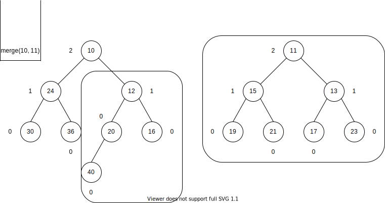

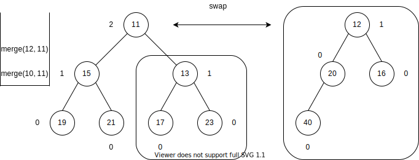

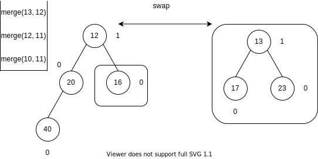

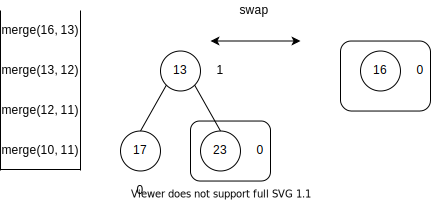

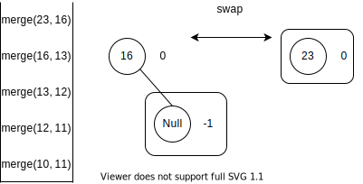

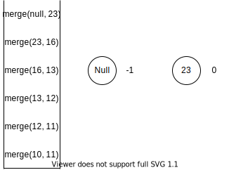

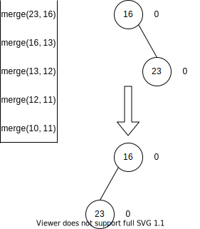

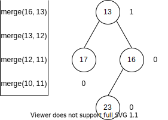

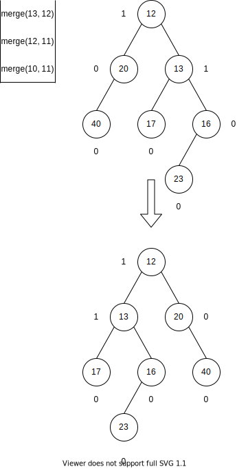

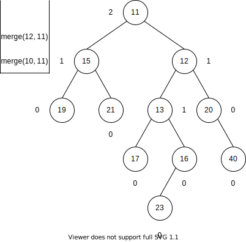

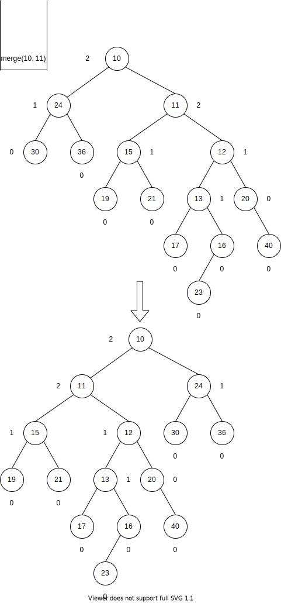


## 插入

插入一个新节点就是把待插入节点作为一棵单节点的左偏树，然后合并两棵左偏树

```cpp
template <typename T>
void LeftistHeap<T>::insert(T const &val) {
  Node<T> *p = new Node<T>(val);
  root = merge(root, p);
}
```

## 删除

删除堆顶节点，只需要删除堆顶节点后，合并左右两个子树（左偏树）

```cpp
template <typename T>
void LeftistHeap<T>::remove() {
  auto tmp = root;
  root = merge(root -> lc, root -> rc);
  delete tmp;
}
```

## 初始

初始化左偏树有两种方式。

第一种是每次选择一个节点与树合并，直到所有节点都合并为一个树。这种方法不太有效，时间复杂度为 $\Theta(n \log n)$。

第二种方法是使用队列，第二种方法是使用队列，将队列中前两个节点合并，将合并后的新节点放到队列的末尾，直到队列中只有一个节点。这种方法的时间复杂度为$\Theta(n)$。

```cpp
template <typename T>
LeftistHeap<T>::LeftistHeap(vector<T> const &v) {
  queue<Node<T>*> q;
  for(auto &val : v)
    q.push(new Node<T>(val));
  while(q.size() != 1) {
    auto p1 = q.front();
    q.pop();
    auto p2 = q.front();
    q.pop();
    q.push(merge(p1, p2));
  }
  root = q.front();
  q.pop();
}
```

## 例子

【问题描述】
很久很久以前.在一个广阔的森林里住着n只好斗的猴子。起初.它们各干各的，万相之间也不了解。但是这并不能避免猴子们之间的争论，当然，这只存在于两只陌生猴子之间。当两只猴子争论时，它们都会请自己最强壮的朋友来代表自己进行决斗。显然，决斗之后，这两只猴子以及它们的朋友就互相了解了，这些猴子之间再也不会发生争论了，即使它们曾经发生过冲突。

假设每一只猴子都有一个强壮值，每次决斗后都会减少一半（比如10会变成5，5会变成2）。并且我们假设每只猴子都很了解自己，猴品都很好，就是说.当它属于所有朋友中最强壮的一个时，它自己会站出来，走向决斗场。

【输入格式】

输入分为两部分。

第一部分，第一行有一个整数n（n≤10000），代表猴子总数。接下来的n行，每行一个数表示每只猴子的强壮值（小于等于32768）。

第二部分，第一行有一个整数m（m≤10000），表示有m次冲突会发生。接下来的m 行，每行包含两个数x和y，代表第x个猴子和第y个猴子之间发生冲突。

【输出格式】

输出每次决斗后在它们所有朋友中的最大强壮值。数据保证所有猴子决斗前彼此不认识。

【输入样例】

```
5
20
16
10
10
4
4
2 3
3 4
3 5
1 5
```

【输出样例】

```
8
5
10
```

【问题分析】

本题可以看成存在着若干个大根堆（堆的森林），需要做以下3种基本操作∶查找一只猴子所在的堆并返回堆头元素（最大值），调整堆（解决决斗后强壮值减半问题，且保持堆性质），合并两只决斗猴子所在的堆。

算法实现如下∶将所有猴子的强壮值作为关键字全部设成独立的左偏树。每次两只猴子代表要决斗的时候，我们就可以先找出这两只猴子所在的左偏树的根结点（代表），将这两个根结点的值除以2，再分别调整所在左偏树使之保持堆的性质，然后将它们合并成一棵新的左偏树。

## 参考资料

- [wiki - 左偏树](https://zh.wikipedia.org/wiki/左偏树)
- 林厚从《高级数据结构》
- [左倾堆(一)之 图文解析 和 C语言的实现](https://www.cnblogs.com/skywang12345/p/3638327.html)