# 伸展树

## 简介

伸展树（Splay Tree），是由 Daniel Sleator 和 Robert Tarjan 创造，是对二叉排序树的一种改进。

从访问量上，我们知道许多应用场景都有一个“二八原则”，也就是说80%的人只会用到20%的数据。伸展树在实现上也恰好是利用了这一原理，当某个节点被访问了，伸展树会通过旋转将该节点移动到树的根部，下一次便能快速访问该节点。久而久之，经常访问的节点便会出现在根的附近，而不常访问的节点便会离叶子比较近。

虽然它并不能保证树一直是“平衡”的，但对于它的一系列操作，可以证明其每一步操作的“平摊时间”复杂度都是 $\Theta(\log_2 n)$。平摊时间是指在一系列最坏情况的操作序列中单次操作的平均时间。所以，从某种意义上说，伸展树也是一种平衡的二叉排序树。而在各种树型数据结构中，伸展树的空间复杂度（不需要记录用于平衡的冗余信息）和编程复杂度也都是很优秀的。

## 分类

从上面的介绍中，我们可以知道伸展树最重要的操作就是将某个节点旋转到根节点，这一操作也被称为 `splay`。`splay` 在实现上可以为自底向上和自顶向下两个方法。

- 自底向上表示在实现 `splay` 操作时，从根部一步步向下寻找目标节点，找到目标节点后再一步步将目标节点向上旋转。
- 自顶向下表示在实现 `splay` 操作时，从根部一步步向下寻找目标节点的同时，顺带旋转上面的节点，使得目标节点离根部越来越近。


## 自底向上

自底向上操作需要先找到目标节点，然后再一步步向上旋转。由于需要向上旋转，因此我们节点的数据结构中需要储存一个指向父节点的指针，以此知道父节点是谁。

```cpp
template <typename K>
struct Node {
  K k;
  Node<K> *parent, *lc, *rc;
  Node(K const &key, Node<K> *father = nullptr, Node<K> *plc = nullptr, Node<K> *prc = nullptr):k(key), parent(father), lc(plc), rc(prc) {}
};
```

下面给出伸展树的类结构

```cpp
template <typename T>
class SplayTree {
protected:
  Node<T> *root = nullptr;
  static void zig(Node<T> *);
  static void zag(Node<T> *);
  static void zig_zig(Node<T> *);
  static void zag_zag(Node<T> *);
  static void zig_zag(Node<T> *);
  static void zag_zig(Node<T> *);
  static Node<T>* splay(Node<T> *);
  static Node<T>* merge(Node<T> *x, Node<T> *y);
  static Node<T>* bst_search(T const &val, Node<T> *root);
  static Node<T>* bst_insert(T const &val, Node<T>* &root);
  static Node<T>* bst_rm_min(Node<T> *root);
  static Node<T> *bst_rm_max(Node<T> *root);
  static Node<T> *bst_max(Node<T> *root);
  static Node<T> *bst_min(Node<T> *root);
  static void free(Node<T> *);
public:
  bool find(T const &val);
  void insert(T const &val);
  void remove(T const &val);
  ~SplayTree();
};
```

```cpp
template <typename T>
void SplayTree<T>::free(Node<T> *p) {
  if(p == nullptr)
    return;
  free(p -> lc);
  free(p -> rc);
  delete p;
}

template <typename T>
SplayTree<T>::~SplayTree() {
  free(root);
}
```

### splay

为了了解自底向上的实现，先了解一下自底向上的旋转。

旋转包括：zig（其镜像旋转为 zag）、zig-zig（其镜像旋转为 zag-zag）、zig-zag（其镜像旋转为 zag-zig）

这些旋转与 AVL 树的旋转有些相似性，故在图中已经标明与其相似的 AVL 旋转。

- zig: 目标节点 x 是根节点的左孩子
- zag: 目标节点 x 是根节点的右边子

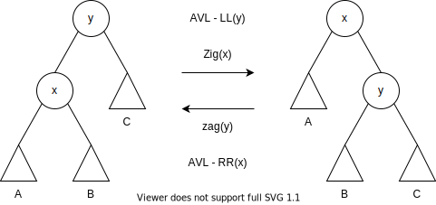

zig 和 zag 旋转也被称为单旋转。

- zig-zig: 目标节点 x 是其父节点 y 的左孩子，y 是其父节点 z 的左孩子。
- zag-zag: 目标节点 x 是其父节点 y 的右孩子，y 是其父节点 z 的右孩子。

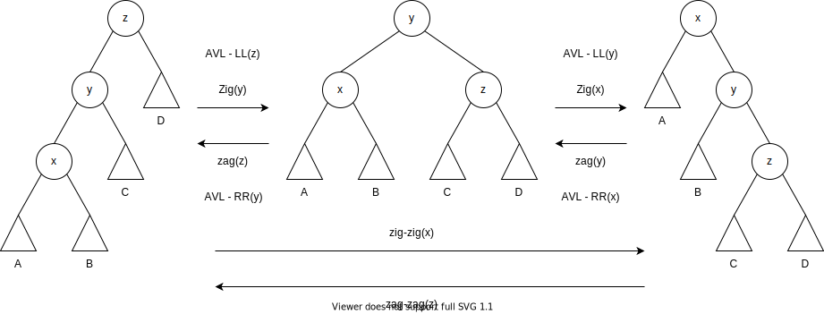

zig-zig 和 zag-zag 的共同特点是三者呈一字型，所以也被称为一字型旋转。

- zig-zag: 目标节点 x 是其父节点 y 的左孩子，y 是其父节点 z 的右孩子
- zag-zig: 目标节点 x 是其父节点 y 的右孩子，y 是其父节点 z 的左孩子

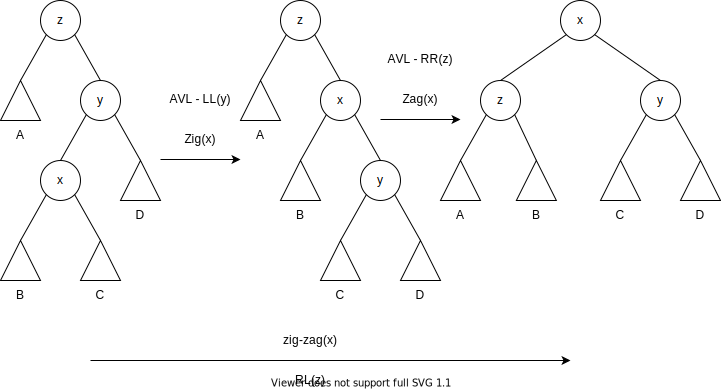

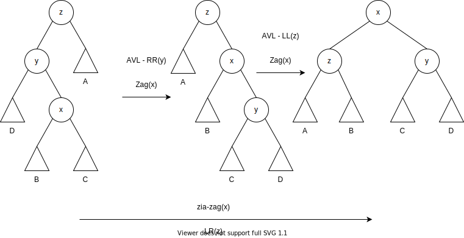

zig-zag 和 zig-zag 的共同特点是三者呈之子型，所以也被称为之字形旋转。

我们可以发现，zig 和 zag 操作使得 x 上升了一个节点，或者说离根节点更近一步了。zig-zig、zag-zag、zig-zag 和 zag-zig 操作使得 x 节点上升了两个节点。所以 `splay` 可以这样实现，如果目标节点距离根节点还有两个极其以上的节点，我们就根据情况使用 zig-zig 或 zag-zag 或 zig-zag 或 zag-zig 使得目标节点上升两个节点，否则使用 zig 或 zag 使得目标节点达到根节点。

```cpp
template <typename T>
void SplayTree<T>::zag(Node<T> *x) {
  Node<T> *l = x -> lc, *p = x -> parent, *pp = p -> parent;
  p -> rc = l;
  if(l)
    l -> parent = p;
  x -> parent = pp;
  if(pp)
    (p == pp -> lc ? pp -> lc : pp -> rc) = x;
  p -> parent = x;
  x -> lc = p;
}

template <typename T>
void SplayTree<T>::zig(Node<T> *x) {
  Node<T> *r = x -> rc, *p = x -> parent, *pp = p -> parent;
  p -> lc = r;
  if(r)
    r -> parent = p;
  x -> parent = pp;
  if(pp)
    (p == pp -> lc ? pp -> lc : pp -> rc) = x;
  p -> parent = x;
  x -> rc = p;
}

template <typename T>
void SplayTree<T>::zig_zig(Node<T> *x) {
  zig(x -> parent);
  zig(x);
}

template <typename T>
void SplayTree<T>::zag_zag(Node<T> *x) {
  zag(x -> parent);
  zag(x);
}

template <typename T>
void SplayTree<T>::zig_zag(Node<T> *x) {
  zig(x);
  zag(x);
}

template <typename T>
void SplayTree<T>::zag_zig(Node<T> *x) {
  zag(x);
  zig(x);
}

// Rotate node x to root node
template <typename T>
Node<T>* SplayTree<T>::splay(Node<T> *x) {
  Node<T> *p = x -> parent, *pp = nullptr;
  while(p) {
    pp = p -> parent;
    if(pp == nullptr) {
      p -> lc == x ? zig(x) : zag(x);
    } else if(x == p -> lc) {
      p == pp -> lc ? zig_zig(x) : zig_zag(x);
    } else {
      p == pp -> rc ? zag_zag(x) : zag_zig(x);
    }
    p = x -> parent;
  }
  return x;
}
```

### 查找

查找操作：先与进行与二叉搜索树一样的查找操作，若目标元素存在树中，则将使用 `splay` 操作将目标元素旋转到树根。

```cpp
template <typename T>
Node<T>* SplayTree<T>::bst_search(T const &val, Node<T> *x) {
  while(x) {
    if(x -> k == val)
      return x;
    else if(val < x -> k)
      x = x -> lc;
    else
      x = x -> rc;
  }
  return x;
}

template <typename T>
bool SplayTree<T>::find(T const& val) {
  auto x = bst_search(val, root);
  if(x == nullptr)
    return false;
  root = splay(x);
  return true;
}
```

### 插入

插入操作：先进行与二叉搜素树一样的插入操作，后使用 `splay` 将插入元素旋转到根部。

```cpp
template <typename T>
Node<T>* SplayTree<T>::bst_insert(T const &val, Node<T>* &root) {
  if(root == nullptr)
    return root = new Node<T>(val);
  Node<T> *parent = nullptr, **x_ptr = &root;
  while(*x_ptr) {
    parent = *x_ptr;
    if(val == (*x_ptr) -> k)
      return *x_ptr;
    else if(val < (*x_ptr) -> k)
      x_ptr = &((*x_ptr) -> lc);
    else
      x_ptr = &((*x_ptr) -> rc);
  }
  return *x_ptr = new Node<T>(val, parent);
}

template <typename T>
void SplayTree<T>::insert(T const &val) {
  auto x = bst_insert(val, root);
  root = splay(x);
}
```

### 合并

合并操作：合并两颗伸展树 x 和 y，其中 x 所有元素都比 y 小。先找到 x 中的最大元素，并将其旋转到根节点，然后将 y 树作为 x 的右子树。

```cpp
template <typename T>
Node<T>* SplayTree<T>::bst_min(Node<T> *root) {
  while(root -> lc)
    root = root -> lc;
  return root;
}

template <typename T>
Node<T>* SplayTree<T>::bst_max(Node<T> *root) {
  while(root -> rc)
    root = root -> rc;
  return root;
}

template <typename T>
Node<T>* SplayTree<T>::merge(Node<T> *x, Node<T> *y) {
  if(!x)
    return y;
  if(!y)
    return x;
  Node<T> *root = bst_max(x);
  splay(root);
  root -> rc = y;
  y -> parent = root;
  return root;
}
```

### 删除

删除操作：将待删除的节点旋转到根节点，然后使用合并操作合并新的左右子树。

```cpp
template <typename T>
void SplayTree<T>::remove(T const &val) {
  if(!find(val))
    return;
  Node<T> *foo = root, *l = root -> lc, *r = root -> rc;
  if(l)
    l -> parent = nullptr;
  if(r)
    r -> parent = nullptr;
  root = merge(l, r);
  delete foo;
}
```

## 自顶向下

从上面可以看到自底向上的实现，是要结点存储一个父指针。而自顶向下的实现则是在边查找目标结点的情况下，边旋转，所以不用存储父指针。

```cpp
template <typename K>
struct Node {
  K k;
  Node<K> *lc, *rc;
  Node(K const &key, Node<K> *plc = nullptr, Node<K> *prc = nullptr):k(key), lc(plc), rc(prc) {}
  Node(): k(K()), lc(nullptr), rc(nullptr) {}
};
```

实现的类结构

```cpp
template <typename T>
class SplayTree {
protected:
  Node<T> *root = nullptr;
  static void free(Node<T> *);
  static void left_join(Node<T>* &root, Node<T>* &l);
  static void right_join(Node<T>* &root, Node<T>* &r);
  static Node<T>* rotate_left(Node<T> *root);
  static Node<T>* rotate_right(Node<T> *root);
  static Node<T>* splay(Node<T> *root, T const &k);
public:
  ~SplayTree();
  bool find(T const &val);
  void insert(T const &val);
  void remove(T const &val);
};
```

一些基本的函数的实现如下

```cpp
template <typename T>
void SplayTree<T>::free(Node<T> *root) {
  if(root == nullptr)
    return;
  free(root -> lc);
  free(root -> rc);
  delete root;
}

template <typename T>
SplayTree<T>::~SplayTree() {
  free(root);
}
```

### splay

在具体 `splay`操作中，需要两棵辅助树（辅助树也是二分搜索树），称为 L 树（左树）和 R 树（右树）。在每一次查找的过程中，由于二分搜索树的特性，我们可以知道，两棵子树中只有一棵子树才可能拥有我们要查找的目标元素，也就是说另一棵子树是“多余的”。自顶向下的核心思想便是利用了这一特性，在查找的过程中，我们不断把“多余的”子树移到 L 树 或 R 树，直到我们找到目标元素，这时才把 L 树 和 R 树 和我们目标元素所在的树（也被称为 M 树，中间树）合并，使得目标元素在新树的根部。

L 树和 R 树的区别在于 L 树用来存储小于中间树最小元素的所有节点，而 R 树用来存储大于中间树最大元素的所有节点。也就是说如果目标元素在左子树，我们就将根节点和右子树移到 R 树，反之，则将根节点和左子树移到 L 树。

将根节点和左子树移动到 L 树，这一操作称为“左连接”。具体实现为将根节点和左子树作为 L 树的最大结点 l 的右子树。

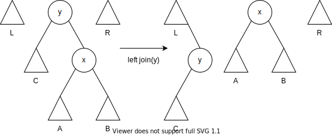

我们可以证明，这些的左连接依旧使得 L 树仍然是一颗二分搜索树。我们可以简单说下思路，例如在某次中，我们将根节点和左子树（将这两者形成的树，记为 X）移动到 L 树，然后我们的中间树就是根节点的右子树（记为 Y），根据二分搜索树的性质，我们可以得知 Y 中元素都大于 X，所以下次将 Y 后代的子树作为 L 树的最大结点 l 的右子树不改变 L 树的二分搜索树的性质。

类似的，将根节点和右子树移动到 R 树，这一操作称为“右连接”。具体实现为将根节点和右子树作为 R 树的最小结点 r 的左子树。这样的操作也不改变 R 树的二分搜索树的性质。

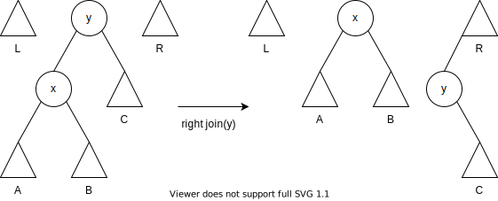

看完了左右连接，看一下合并操作吧。合并操作如下图所示。

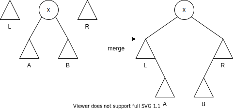

将中间树的左子树 A 作为 L 树最大结点 l 的右子树，将中间树的右子树 B 作为 R 树最小结点 r 的左子树。最后再将 L 树和 R 树最为中间树的左右子树。

似乎我们都知道 `splay` 是怎么实现的了。但是我们总是希望最后生成的树能够更加平衡，因此仅仅靠左右连接还是不够，我们可以引入像 zig(或称为 rotate left) 和 zag(或称为 ratote right) 的旋转使得最后的树更加平衡。例如在下面的树中，查找目标元素 10。

只有左右连接操作的效果。

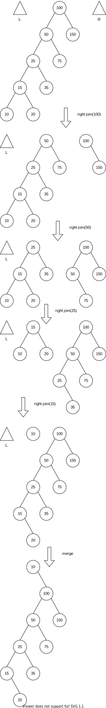

加入旋转操作的效果。

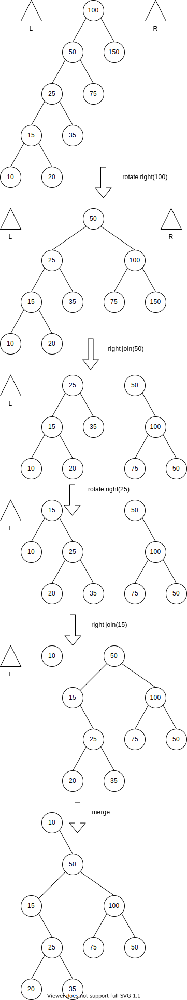

从上面两个例子，我们看出，加入旋转操作后最后的树会更加平衡。虽然例子只是少了一层，但是数据量大的情况下，会有明显的差异。

我们使用伪代码来说明一下我们如何结合连接操作和旋转操作

```
function splay(root, target)
  while(1)
    if target < root.key
      if k < root.lc.key
        rotate_right(root)
      right_join(root, R)
    elif target > root.key
      if target > root.rc.key
        rotate_left(root)
      left_join(root, L)
    else
      break
  merge(L, root, R)     
```

当 `target < root.key` 且 `target >= root.lc.key` 时，也就是说 `target` 只能出现在 `root` 的左子树，我们就只进行右链接，使得左子树成为新的中间树。


当 `target < root.key` 且 `target < root.lc.key` 时，也就是说 `target` 只能出现在 `root` 的左孩子的左子树，我们就进行右旋转和右链接，使得左孩子的左子树成为新的中间树。

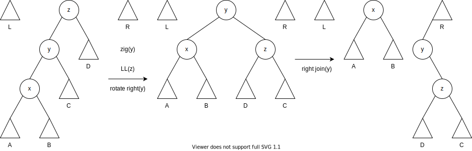

当 `target > root.key` 且 `target <= root.rc.key` 时，也就是说 `target` 只能出现在 `root` 的右子树，我们就只进行左链接，使得右子树成为新的中间树。


当 `target > root.key` 且 `target > root.rc.key` 时，也就是说 `target` 只能出现在 `root` 的右孩子的右子树，我们就进行左旋转和左链接，使得右孩子的右子树成为新的中间树。

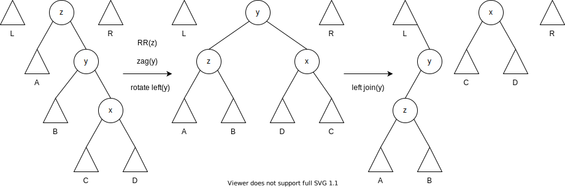


C++ 代码如下

```cpp
template <typename T>
void SplayTree<T>::left_join(Node<T>* &root, Node<T>* &l) {
  l -> rc = root;
  l = root;
  root = root -> rc;
  //l -> rc = nullptr; // unnecessary
}

template <typename T>
void SplayTree<T>::right_join(Node<T> *&root, Node<T> *&r) {
  r -> lc = root;
  r = root;
  root = root -> lc;
  //r -> lc = nullptr; // Unnecessary
}

template <typename T>
Node<T>* SplayTree<T>::rotate_right(Node<T> *root) {
  auto l = root -> lc;
  root -> rc = l -> rc;
  l -> rc = root;
  return l;
}

template <typename T>
Node<T>* SplayTree<T>::rotate_left(Node<T> *root) {
  auto r = root -> rc;
  root -> rc = r -> lc;
  r -> lc = root;
  return r;
}

template <typename T>
Node<T>* SplayTree<T>::splay(Node<T> *root, T const &target) {
  Node<T> node, *l = &node, *r = &node;
  while(1) {
    if(target < root -> k) {
      if(root -> lc == nullptr)
        break;
      else if(target < root -> lc -> k) {
        root = rotate_right(root);
        if(root -> lc == nullptr)
          break;
      }
      right_join(root, r);
    } else if(target > root -> k) {
      if(root -> rc == nullptr)
        break;
      else if(target > root -> rc -> k) {
        root = rotate_left(root);
        if(root -> rc == nullptr)
          break;
      }
      left_join(root, l);
    } else // k == root -> k
      break;
  }
  //merge
  l -> rc = root -> lc;
  r -> lc = root -> rc;
  root -> lc = node.rc;
  root -> rc = node.lc;
  
  return root;
}
```

最后探讨一下 `splay` 操作后，树根的元素是什么？

- 如果存在值为 `target` 的节点：则将值为 `target` 的节点旋转到树根
- 如果不存在值为 `target` 的节点
	- 如果 `target` 小于树中任何元素：则将树中最小元素旋转到树根
	- 如果 `target` 大于树中任何元素：则将树中最大元素旋转到树根
	- 如果树中存在大于和小于 `target` 的元素
		- `target < root-> k`：则将小于 `target` 且值最大的元素旋转到树根
		- `target > root-> k`：则将大于 `target` 且值最小的元素旋转到树根

### 查找

```cpp
template <typename T>
bool SplayTree<T>::find(T const &val) {
  root = splay(root, val);
  return root -> k == val;
}
```

如果想让最后的树跟自底向上一样的话，查找函数应该改为如下

```cpp
template <typename T>
Node<T>* bst_search(Node<T> *root, T const &k) {
  while(root) {
    if(root -> k == k)
      return root;
    else if(k < root -> k)
      root = root -> lc;
    else
      root = root -> rc;
  }
  return root;
}

template <typename T>
bool SplayTree<T>::find(T const &val) {
  if(bst_search(root, val) == nullptr)
    return false;
  root = splay(root, val);
  return true;
}
```

### 插入

```cpp
template <typename T>
void SplayTree<T>::insert(T const &val) {
  if(root == nullptr) {
    root = new Node<T>(val);
    return;
  }
  root = splay(root, val);
  if(root -> k < val) {
    Node<T> *node = new Node<T>(val, root, root -> rc);
    root -> rc = nullptr;
    root = node;
  } else if(root -> k > val) {
    Node<T> *node = new Node<T>(val, root -> lc, root);
    root -> lc = nullptr;
    root = node;
  }
}
```

如果想让最后的树跟自底向上一样的话，函数应该改为如下

```cpp
template <typename T>
Node<T>* bst_insert(T const &val, Node<T>* &root) {
  if(root == nullptr)
    return root = new Node<T>(val);
  Node<T> *parent = nullptr, **x_ptr = &root;
  while(*x_ptr) {
    parent = *x_ptr;
    if(val == (*x_ptr) -> k)
      return *x_ptr;
    else if(val < (*x_ptr) -> k)
      x_ptr = &((*x_ptr) -> lc);
    else
      x_ptr = &((*x_ptr) -> rc);
  }
  return *x_ptr = new Node<T>(val);
}

template <typename T>
void SplayTree<T>::insert(T const &val) {
  bst_insert(val, root);
  root = splay(root, val);
}
```

### 删除

```cpp
template <typename T>
void SplayTree<T>::remove(T const &val) {
  if(root == nullptr)
    return;
  root = splay(root, val);
  if(root -> k == val) {
    Node<T> *foo = root, *l = root -> lc;
    if(l) {
      l = splay(l, val); // Let the maximum of l be the root of l.
      l -> rc = root -> rc;
      root = l;
    } else
      root = root -> rc;
    delete foo;
  }
}
```

如果想让最后的树跟自底向上一样的话，函数应该改为如下

```cpp
template <typename T>
void SplayTree<T>::remove(T const& val) {
  if(bst_search(root, val) == nullptr)
    return;
  root = splay(root, val);
  Node<T> *foo = root, *l = root -> lc;
  if(l) {
    l = splay(l, val);
    l -> rc = root -> rc;
    root = l;
  } else
    root = root -> rc;
  delete foo;
}
```

## 参考资料

- [伸展树(一)之 图文解析 和 C语言的实现](https://www.cnblogs.com/skywang12345/p/3604238.html)
- [kernel@hcy - 伸展树](https://www.cnblogs.com/kernel_hcy/archive/2010/03/17/1688360.html)
- [伸展树——自顶向下](https://www.cnblogs.com/wuchanming/p/3843304.html)