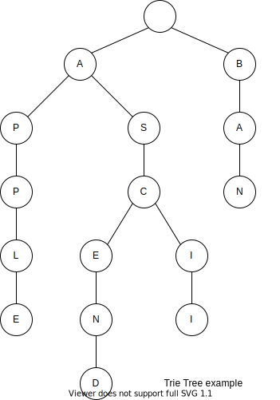
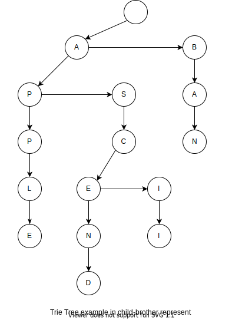
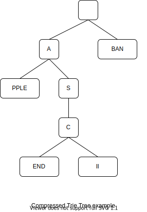
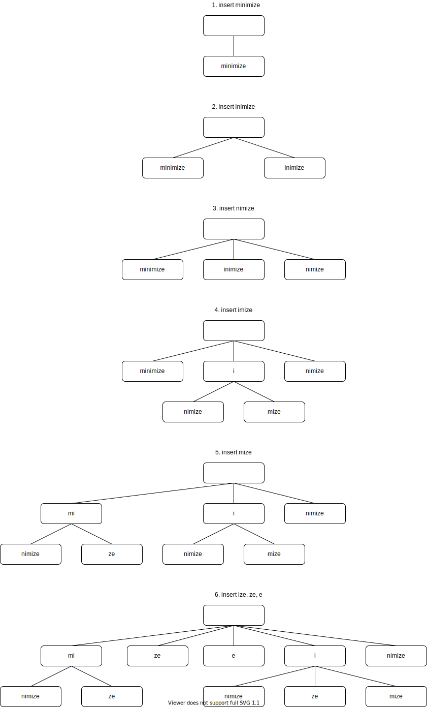

# 字典树

## 简介

字典树，又称单词查找树、Trie树、前缀树，是一种哈希树的变种。典型应用有如下几种：

- 用于统计，排序和保存大量的字符串（但不仅限于字符串），所以经常被搜索引擎系统用于文本词频统计。
- 字符串的快速检索
- 求最长公共前缀

基本性质：

- 根节点不包含字符，除根节点外每一个节点都只包含一个字符。
- 从根节点到某一个节点，路径上经过的字符连接起来，为该节点对应的字符串。
- 每个节点的所有子节点包含的字符都不相同。

例如一棵包含了`APPLE`、`ASCEND`、`ASCII`和`BAN`的字典树如下：



从上面的图中，我们也可以看到它为什么被称为前缀树的原因，一个节点的所有子孙都有相同的前缀。

它的优点是：利用字符串的公共前缀来减少查询时间，最大限度地减少无谓的字符串比较，查询效率比哈希树高。

## 实现

### 节点

根据字符集大小和字符串大小等实际情况，我们可以有不同的结点实现，下面给出三种比较常见的实现。

为了这三种实现能够有效的统一起来，给结点设置了一个共同的基类

```cpp
template <typename T>
class Node {
public:
  T c;
  bool finish = false;
  Node(T const &ch, bool finished = false): c(ch), finish(finished) {}
  virtual Node<T>* getChild(T const &ch) const = 0;
  virtual Node<T>* insertChild(T const &ch) =0;
  virtual void destroy() =0;
  virtual ~Node(){};
};
```

- `Node<T>* getChild(T const &c)`：返回该结点中孩子为字符`c`的结点
- `Node<T>* insertChild(T const &c)`：返回插入`c`后的孩子结点
- `void destroy()`：释放以该结点为根的子树的空间
- `finish`属性：表示从根节点到当前节点表示的字符串是否出现过。

#### “固定节点数目”表示法

对于节点的实现方法最简单的实现的方法便是固定孩子节点的数目，孩子结点的个数就是字符集的大小。

```cpp
template <typename T>
class FixedSizeNode: public Node<T> {
protected:
  static const int MAX_CHILD_CNT = 256;
  vector< FixedSizeNode<T>* > children;
public:
  FixedSizeNode(T const &ch, bool finished = false):Node<T>(ch, finished), children(MAX_CHILD_CNT, nullptr) {}
  FixedSizeNode<T>* getChild(T const &ch) const {
    return children[ch];
  }
  FixedSizeNode<T>* insertChild(T const &ch) {
    return children[ch] ? children[ch] : (children[ch] = new FixedSizeNode<T>(ch));
  }
  void destroy() {
    for(auto &pnode: children)
      destroy(pnode);
  }
  void destroy(FixedSizeNode<T> *root) {
    if(root == nullptr)
      return;
    for(auto &pnode : root -> children)
      destroy(pnode);
    delete root;
  }
};
```

#### “孩子兄弟”表示法

但是如果字符的种类数很多的话，例如中文，使用固定孩子节点的数目的实现会造成巨大的内存浪费。

为了减少对内存的使用，我们对树使用“孩子兄弟”表示法（实际上就是将树变成二叉树），上面例子的树如下图所示。



节点代码如下。

```cpp
template <typename T>
class ChildBrotherNode: public Node<T> {
protected:
  ChildBrotherNode<T> *child = nullptr, *bro = nullptr; //child, brother
public:
  ChildBrotherNode(T const &ch, bool finished = false): Node<T>(ch, finished) {}
  ChildBrotherNode<T>* getChild(T const &ch) const {
    auto p = child;
    while(p && ch != p -> c)
      p = p -> bro;
    return p;
  }
  ChildBrotherNode<T>* insertChild(T const &ch) {
    for(ChildBrotherNode<T> **p = &child; true; p = &((*p) -> bro) ) {
      if(*p == nullptr)
        return *p = new ChildBrotherNode<T>(ch);
      else if((*p) -> c == ch)
        return *p;
    }
    return nullptr;//redubant, for robustness
  }
  void destroy() {
    destroy(child);
    destroy(bro);
  }
  void destroy(ChildBrotherNode<T> *root) {
    if(root == nullptr)
      return;
    destroy(root -> child);
    destroy(root -> bro);
    delete root;
  }
};

```

#### “哈希树”（键值对）表示法

> 有人说Trie树的孩子兄弟表示法只是简单的“时间换空间”，因为一般的Trie树可以直接查出某个结点是否有指定字母的孩子，然而孩子兄弟表示法的Trie树可能要检索整个孩子列表，最坏的情况下检索的长度会达到字符集的大小，Trie树所用的时间可能达到普通字典树所用的时间乘以字符集大小，实际上不可能到这么大，因为不是每个结点下面的孩子都是满的。

一种比较平衡的方式，即是对孩子节点的指针的维护使用哈希树（键值对）的形式进行维护，这种方式在孩子节点不多的情况下，空间复杂度小于“固定孩子数量”表示法，大于“孩子兄弟”表示法，时间复杂度大于“固定孩子数量”表示法，小于“孩子兄弟”表示法。

例如在 C++ 中，我们可以直接可以使用`map`

```cpp
template <typename T>
class KVNode: public Node<T> {
protected:
  map<T, KVNode<T>*> children;
public:
  KVNode(T const &ch, bool finished = false):Node<T>(ch, finished) {}
  KVNode<T>* getChild(T const &ch) const {
    auto res = children.find(ch);
    return res == children.end() ? nullptr : res -> second;
  }
  KVNode<T>* insertChild(T const &ch) {
    auto res = children.insert(pair<T, KVNode<T>*>{ch, nullptr});
    return res.second ? res.first -> second = new KVNode<T>(ch) : res.first -> second;
  }
  void destroy() {
    for(auto &val: children)
      destroy(val.second);
  }
  void destroy(KVNode<T> *root) {
    if(root == nullptr)
      return;
    for(auto &val : root -> children)
      destroy(val.second);
    delete root;
  }
};
```

### API 接口

```cpp
template <typename T>
class TrieTree {
public:
  TrieTree() {
#ifdef _TRIE_TREE_FIXED_SIZE_NODE_H
    _root = new FixedSizeNode<T>(T());
#endif
#ifdef _TRIE_TREE_CHILD_BROTHER_NODE_H
    _root = new ChildBrotherNode<T>(T());
#endif
#ifdef _TRIE_TREE_KV_NODE_H
    _root = new KVNode<T>(T());
#endif
  }
  ~TrieTree() {
    _root -> destroy();
    delete _root;
  }
  bool search(const vector<T> &word) const;
  void insert(const vector<T> &word);
protected:
  Node<T> *_root;
};
```

为了编码的方便，我们使用宏命令来选择不同的结点类型。

### 插入

从例子的图中，很明显的实现方式便是遍历插入单词的字符，从根节点一步步向下插入子节点。

```cpp
template <typename T>
void TrieTree<T>::insert(const vector<T> &word) {
  Node<T> *p = _root;
  for(auto &c: word) {
    p = p -> insertChild(c);
  }
  p -> finish = true;
}
```

### 查找

类似插入

```cpp
template <typename T>
bool TrieTree<T>::search(const vector<T> &word) const {
  Node<T> *p = _root;
  for(auto &c: word) {
    p = p -> getChild(c);
    if(p == nullptr)
      return false;
  }
  return p -> finish;
}
```

从上的图，很容易看出字典树插入和查找一个单词的时间复杂度都是$\Theta(n)$，

## 例子

> 给你一个字符串集合，请从中找出一些字符串，使得找出来的这些字符串的最长公共前缀与字符串数的总个数的乘积最大化，并输出这个最大值。

我们只需要在每个字母结点上使用`cnt`表示有多少个单词经过该结点，然后在插入单词时，顺便统计一下当前的深度与经过该结点的单词的数量的乘积，不断更新最大值，最后这个最大值就是答案。主要的问题在于 Trie Tree 结构的具体实现方式。

为了简化题目，我们假设空间足够，字节集只有小写字母。如下的具体实现代码使用静态节点（数组模拟树）的方法。

```cpp
const int ROOT_IDX = 0;
template <typename T>
struct Node {
  static const int MAX_CHILD_CNT = 1 << (sizeof(T) * 8);
  T c;
  int children[MAX_CHILD_CNT];
  int cnt = 1; // count of prefixion
  Node(T const &ch):c(c) {
    std::fill_n(children, MAX_CHILD_CNT, ROOT_IDX);
  }
};

template <typename T>
class StaticTrieTree {
public:
  StaticTrieTree() {
    _tree.push_back(Node<T>(T())); //insert the root node
  }
  void insert(std::vector<T> const &word) {
    int idx = 0;
    for(int i = 1; i <= word.size(); ++i) {
      auto c = word[i-1];
      //insert the character c
      if(_tree[idx].children[c] == ROOT_IDX) {
        _tree.push_back(Node<T>(c));
        idx = _tree[idx].children[c] = _tree.size() - 1;
      } else {
        idx = _tree[idx].children[c];
        ++ _tree[idx].cnt;
      }
      //update the answer
      ans = std::max(ans, _tree[idx].cnt * i);
    }
  }
  int getAns() {
    return ans;
  }
protected:
  int ans = 0;
  std::vector<Node<T>> _tree;
};
```

## 优化

> 很多情况下，字典树中字母的个数远大于单词的个数，此时字典树中就会有很多结点只有一个孩子，如果能将连续的只有一个孩子的结点合并起来，无疑能够大大地减少结点个数，起到节约空间和时间的效果。“压缩的字典树(Compressed Trie)”就采用了这种思想，压缩的字典树的每个结点不是仅仅记录一个字母，而是一个连续的字符串。

如上图的例子的“压缩的字典树如下”



通过压缩算法，使得树中将不存在某个节点只有一个孩子，这样可以将树的节点数量控制$\Theta(n)$，其中$n$为单词的个数。

实际处理时把所有字符串放在一个大数组中，每个结点只记录该点的字符串在数组中的起始位置和终止位置。当然，在使用这种方法时，应在插入单词时动态地扩展字典树，而不是将字典树建好后再压缩。

### 节点的定义

```cpp
template <typename T>
struct Node {
  map<T, int> children;
  bool finish;
  int st, ed; //start and end, [st, ed) of buffer
  Node(bool finished = false, int start = 0, int end = 0): finish(finished), st(start), ed(end) {}
};
```

上面的`st`和`ed`表示这个节点代表着的字符串为缓冲区`_buf`的`[st, ed)`。

### API

```cpp
template <typename T>
class CompressTrieTree {
public:
  CompressTrieTree() {
    _tree.push_back(Node<T>());
  }
  void insert(vector<T> const &word) {
    insert(word, 0, 0);
  }
  bool search(vector<T> &word) const;
protected:
  vector<Node<T>> _tree;
  vector<T> _buff; //buffer, storing words

  //return length of word [st, word.size()) and _buff [node.st, node.ed)
  int common_prefix_len(vector<T> const &word, int st, Node<T> const &node);
  
  void split(Node<T> &node, int cpl);
  
  //insert word [st, word.size()) into node
  void insert(vector<T> const &word, int st, int node_idx);
};
```

### 查找

```cpp
template <typename T>
bool CompressTrieTree<T>::search(vector<T> &word) const {
  for(int st = 0, idx = 0; st < word.size();) {
    auto res = _tree[idx].children.find(word[st]);
    if(res == _tree[idx].children.end())
      return false;
    idx = res -> second;  
    auto &node = _tree[idx];
    auto l1 = node.ed - node.st,
         l2 = word.size() - st;
    if(l1 > l2)
      return false;
    //compare _buff[node.st, node.ed) with word[st, st + l1)
    for(int i = 0; i < l1; ++i)
      if(_buff[node.st + i] != word[st++])
        return false;
    if(st == word.size())
      return node.finish;
  }
  return true;
}
```

### 插入



由于插入，有时候将节点进行拆分。

我们先给出计算指定节点与被插入单词（从`st`开始）的共同长度。

```cpp
template <typename T>
int CompressTrieTree<T>::common_prefix_len(vector<T> const &word, int st, Node<T> const &node) {
  int i = 0;
  for(int n = min(int(word.size() - st), node.ed - node.st); i < n && word[st + i] == _buff[node.st + i]; ++i);
  return i; 
}
```

在插入单词的时候，我们先计算单词与当前节点字符串的共同前缀长度$cpl$

1. 如果$cpl$小于当前节点字符串长度，那么我们就需要对当前节点按$cpl$进行拆分，拆分成两个节点。
2. 如果单词还没有全部插入完成的话，我们递归向下插入。

```cpp
//cpl is common prefix length
template <typename T>
void CompressTrieTree<T>::split(Node<T> &node, int cpl) {
  int old_ed = node.ed;
  node.ed = node.st + cpl;
  Node<T> child(node.finish, node.ed, old_ed);
  node.finish = false;
  //reset the children
  swap(node.children, child.children);
  node.children[_buff[node.ed]] = _tree.size();
  //insert a new node
  _tree.push_back(child);
}

//insert word [st, word.size()) into node
template <typename T>
void CompressTrieTree<T>::insert(vector<T> const &word, int st, int node_idx) {
  
  auto cpl = common_prefix_len(word, st, _tree[node_idx]); //cpl is common prefix length 
  // determine if split is needed, `cpl != node.ed - node.st` is equivalent to `cpl < node.ed - node.st`, for cpl <= node.ed - node.st
  if(cpl != _tree[node_idx].ed - _tree[node_idx].st)
    split(_tree[node_idx], cpl);
  
  st += cpl;
  if(st == word.size()) /* the word has been inserted completely */{
    _tree[node_idx].finish = true;
  } else {
    auto res = _tree[node_idx].children.find(word[st]);
    if(res != _tree[node_idx].children.end()) {
      insert(word, st, res -> second); // insert recursively
    } else {
      //insert a new node
      _tree.push_back(Node<T>(true, _buff.size(), _buff.size() + word.size() - st));
      _tree[node_idx].children[word[st]] = _tree.size() - 1;
      // push the remaining characters into the _buff
      _buff.insert(_buff.end(), word.begin() + st, word.end());
    }
  }
}
```

## Trie树和DFA，确定有限状态自动机

trie树实际上是一个DFA，通常用转移矩阵表示。行表示状态，列表示输入字符，（行，列）位置表示转移状态。这种方式的查询效率很高，但由于稀疏的现象严重，空间利用效率很低。也可以采用压缩的存储方式即链表来表示状态转移，但由于要线性查询，会造成效率低下。

## 参考资料

- [wiki Trie](https://en.wikipedia.org/wiki/Trie)
- 林厚从《高级数据结构 C++版》第三版