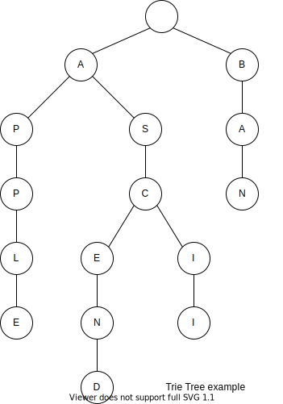
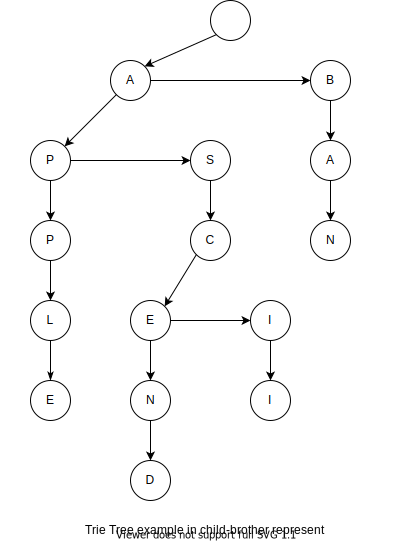

# 简介
字典树，又称单词查找树、Trie树、前缀树，是一种哈希树的变种。典型应用有如下几种：
- 用于统计，排序和保存大量的字符串（但不仅限于字符串），所以经常被搜索引擎系统用于文本词频统计。
- 字符串的快速检索
- 求最长公共前缀

基本性质：
- 根节点不包含字符，除根节点外每一个节点都只包含一个字符。
- 从根节点到某一个节点，路径上经过的字符连接起来，为该节点对应的字符串。
- 每个节点的所有子节点包含的字符都不相同。

例如一棵包含了`APPLE`、`ASCEND`、`ASCII`和`BAN`的字典树如下：


从上面的图中，我们也可以看到它为什么被称为前缀树的原因，一个节点的所有子孙都有相同的前缀。

它的优点是：利用字符串的公共前缀来减少查询时间，最大限度地减少无谓的字符串比较，查询效率比哈希树高。

# 实现
## 节点
### “固定节点数目”表示法
对于节点的实现方法最简单的实现的方法便是固定孩子节点的数目。
```cpp
template <typename T>
struct Node {
  static const int MAX_CHILD_CNT = 26;
  T c;
  Node<T>* children[MAX_CHILD_CNT];
  Node(T const &ch):c(ch) {
    std::fill_n(children, MAX_CHILD_CNT, nullptr);
  }
};
```
这里`finish`表示从根节点到当前节点是否已经有了
### “孩子兄弟”表示法
但是如果字符的种类数很多的话，例如中文，使用固定孩子节点的数目的实现会造成巨大的内存浪费。

为了减少对内存的使用，我们对树使用“孩子兄弟”表示法（实际上就是将树变成二叉树），上面例子的树如下图所示。


节点代码如下。
```cpp
template <typename T>
struct Node {
  T c;
  Node<T> *child, *bro; //child, brother
  Node(T const &ch, Node<T> *son = nullptr, Node<T> *brother = nullptr): c(ch), child(son), bro(brother) {}
  
  Node<T>* hasChild(T const &ch) const {
    auto p = child;
    while(p && ch != p -> c)
      p = p -> bro;
    return p;
  }
};
```

### “哈希树”（键值对）表示法
> 有人说Trie树的孩子兄弟表示法只是简单的“时间换空间”，因为一般的Trie树可以直接查出某个结点是否有指定字母的孩子，然而孩子兄弟表示法的Trie树可能要检索整个孩子列表，最坏的情况下检索的长度会达到字符集的大小，Trie树所用的时间可能达到普通字典树所用的时间乘以字符集大小，实际上不可能到这么大，因为不是每个结点下面的孩子都是满的。

一种比较平衡的方式，即是对孩子节点的指针的维护使用哈希树（键值对）的形式进行维护，这种方式在孩子节点不多的情况下，空间复杂度小于“固定孩子数量”表示法，大于“孩子兄弟”表示法，时间复杂度大于“固定孩子数量”表示法，小于“孩子兄弟”表示法。

例如在 C++ 中，我们可以直接可以使用`map`
```cpp
template <typename T>
struct Node {
  T c;
  std::map<T, Node<T>*> children;
  Node(T const &ch):c(ch) {}
  Node<T>* hasChild(T const &ch) const {
    auto res = children.find(c);
    return res == children.end() ? nullptr : res -> second;
  }
};
```
## 结构
```cpp
template <typename T>
class TrieTree {
public:
  TrieTree() {
    _root = new Node<T>(T());
  }
  ~TrieTree() {
    _root -> destroy();
    delete _root;
  }
protected:
  Node<T> *_root;
};
```
## 插入
从例子的图中，很明显的实现方式便是遍历插入单词的字符，从根节点一步步向下插入子节点。
```cpp
void insert(const std::vector<T> &word) {
  Node<T> *p = _root;
  for(auto &c: word) {
    p = p -> insertChild(c);
  }
  p -> finish = true;
}
```
## 查找
类比插入
```cpp
bool search(const std::vector<T> &word) const {
  Node<T> *p = _root;
  for(auto &c: word) {
    p = p -> getChild(c);
    if(p == nullptr)
      return false;
  }
  return p -> finish;
}
```
从上的图，很容易看出字典树插入和查找一个单词的时间复杂度都是$\Theta(n)$，

## 关于上述实现
上面的代码中为了演示几种节点的定义，所以封装了几个方法，例如`getChild`、`insertChild`和`destroy`，使得这些节点在外部接口上具有统一性，但这样使得代码的阅读好像显得有点难理解（总是感觉有点变扭）。如果确定了使用某个定义的话，个人还是习惯将这些方法放在`TrieTree`这个类里面。

# 例子
这里顺便使用 [leetcode longest common prefix](https://leetcode-cn.com/problems/longest-common-prefix/)来说明公共前缀的实现。

我们给`Node`多了一个`cnt`，用来记录当前前缀的个数，在插入单词的时候，不断更新`cnt`属性。等到所有单词插入完成后，从根部往下查找第一个拥有超过一个孩子的节点，并返回该节点的`cnt`属性，即我们需要的答案。

当然，这道题用 Trie Tree，简直浪费时间和空间，有更好的做法，下面再修改题目的描述，使之更符合 Trie Tree 的应用。

> 给你一个字符串集合，请从中找出一些字符串，使得找出来的这些字符串的最长公共前缀与字符串数的总个数的乘积最大化，并输出这个最大值。

修改后的题目采用 Trie Tree 结构处理起来很直观，也比较简单。只需要在每个字母结点上多记录个值`cnt`表示有多少个单词经过该结点，然后在插入单词时，顺便统计一下当前的深度与经过该结点的单词的数量的乘积，不断更新最大值，最后这个最大值就是答案。主要的问题在于 Trie Tree 结构的具体实现方式。

如果题目要求如下：
- 字符集为大小写字母
- 字符个数$n$满足$(1 \leq n \leq 10^6)$，30% 的数据，$n \leq 10^3$
- 字符长度不超过 $2 \times 10^4$
- 空间限制为 256MB
- 每个测试点为 2 秒

如果按照“固定节点数量”表示法，粗略最坏情况下计算下空间（使用`char`储存一个字母），储存节点字符的空间约为$10^6 \times 2 \times 10^4 \times 52 \ byte = 2 \times 10^{12} \ byte = 2 T$，空间明显不满足。

所以以上面空间最节省的方式 - “孩子兄弟”表示法，

为了简化题目，我们假设空间足够，字节集只有小写字母，在下面的代码使用静态节点（数组模拟树）。

# 优化
> 很多情况下，字典树中字母的个数远大于单词的个数，此时字典树中就会有很多结点只有个孩子，如果能将连续的只有一个孩子的结点合并起来，无疑能够大大地减少结点个数，起到节约空间和时间的效果。“压缩的字典树(Compressed Trie)”就采用了这种思想，压缩的字典树的每个结点不是仅仅记录一个字母，而是一个连续的字符串。

如上图的例子的“压缩的字典树如下”

通过压缩算法，使得树种不存在某个节点只有一个孩子，这样可以将树的节点数量控制$\Theta(n)$，其中$n$为单词的个数。

实际处理时把所有字符串放在一个大数组中，每个结点只记录该点的字符串在数组中的起始位置和终止位置。当然，在使用这种方法时，应在插入单词时动态地扩展字典树，而不是将字典树建好后再压缩。

## 节点的定义
```cpp
template <typename T>
struct Node {
  std::map<T, int> children;
  bool finish;
  int st, ed; //start and end, [st, ed) of buffer
  Node(bool finished = false, int start = 0, int end = 0): finish(finished), st(start), ed(end) {}
};
```
上面的`st`和`ed`表示这个节点代表着的字符串为缓冲区`buffer`的`[st, ed)`。

## 大体结构
```cpp
template <typename T>
class CompressTrieTree {
public:
  bool search(std::vector<T> &word) const;
  CompressTrieTree() {
    _tree.push_back(Node<T>());
  }
  void insert(std::vector<T> const &word) {
    insert(word, 0, _tree.front());
  }
protected:
  std::vector<Node<T>> _tree;
  std::vector<T> _buff; //buffer, storing words
};
```
## 查找
```cpp
bool search(std::vector<T> &word) const {
  for(int st = 0, idx = 0; st < word.size();) {
    auto res = _tree[idx].children.find(word[st]);
    if(res == _tree[idx].children.end())
      return false;
    idx = res -> second;  
    auto &node = _tree[idx];
    auto l1 = node.ed - node.st,
         l2 = word.size() - st;
    if(l1 > l2)
      return false;
    //compare _buff[node.st, node.ed) with word[st, st + l1)
    for(int i = 0; i < l1; ++i)
      if(_buff[node.st + i] != word[st++])
        return false;
    if(st == word.size())
      return node.finish;
  }
  return true;
}
```

## 插入
由于插入，有时候将节点进行拆分。

我们先给出计算指定节点与被插入单词（从`st`开始）的共同长度。
```cpp
int common_prefix_len(std::vector<T> const &word, int st, Node<T> const &node) {
  int i = 0;
  for(int n = std::min(word.size() - st, node.ed - node.st); word[st + i] == _buff[node.st + i] && i < n; ++i);
  return i; 
}
```

在插入单词的时候，我们先计算单词与当前节点字符串的共同前缀长度$cpl$
1. 如果$cpl$小于当前节点字符串长度，那么我们就需要对当前节点按$cpl$进行拆分，拆分成两个节点。
2. 如果单词还没有全部插入完成的话，我们递归向下插入。

```cpp
//cpl is common prefix length
void split(Node<T> &node, int cpl) {
  int old_ed = node.ed;
  node.ed = node.st + cpl;
  Node<T> child(false, node.ed, old_ed);
  //reset the children
  std::swap(node.children, child.children);
  //insert a new node
  _tree.push_back(child);
  node.children[_buff[node.ed]] = _tree.size() - 1;
}
//insert word [st, word.size()) into node
void insert(std::vector<T> const &word, int st, Node<T> &node) {
  auto cpl = common_prefix_len(word, st, node); //cpl is common prefix length 
  // determine if split is needed, `cpl != node.ed - node.st` is equivalent to `cpl < node.ed - node.st`, for cpl <= node.ed - node.st
  if(cpl != node.ed - node.st)
    split(node, cpl);
  
  st += cpl;
  if(st == word.size()) /* the word has been inserted completely */{
    node.finish = true;
  } else {
    auto res = node.children.find(word[st]);
    if(res != node.children.end()) {
      insert(word, st, _tree[res -> second]); // insert recursively
    } else {
      //insert a new node
      _tree.push_back(Node<T>(true, _buff.size(), _buff.size() + word.size() - st));
      node.children[word[st]] = _tree.size() - 1;
      // push the remaining characters into the _buff
      _buff.insert(_buff.end(), word.begin() + st, word.end());
    }
  }
}
```
# Trie树和DFA，确定有限状态自动机
trie树实际上是一个DFA，通常用转移矩阵表示。行表示状态，列表示输入字符，（行，列）位置表示转移状态。这种方式的查询效率很高，但由于稀疏的现象严重，空间利用效率很低。也可以采用压缩的存储方式即链表来表示状态转移，但由于要线性查询，会造成效率低下。

参考资料
- [wiki Trie](https://en.wikipedia.org/wiki/Trie)
- 林厚从《高级数据结构 C++版》第三版