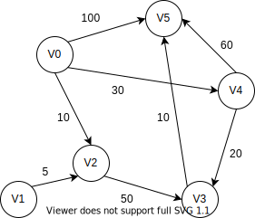
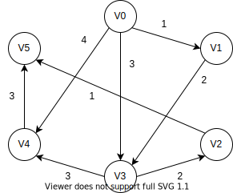

# Dijkstra

## 简介

Dijikstra （迪杰斯特拉）算法用来解决单源最短路径问题，即给定图$G$和起点$s$，通过算法得到S到达其他每个顶点的最短距离。

为了方便描述，我们引入下面的记号。

- 图$G(V, E)$，节点个数为$n$
- 集合$S$：已经被访问过的节点的集合
- $d[i]$：表示当前起点$s$到节点$i$的最短距离。
- $e[u][v]$：节点$u$与其邻居节点$v$的边或其距离

Dijistra 的核心公式便是$d[v] = \underset{u_i \ is \ neighbour \ of \  v}{\min} (d[v], d[u_i] + e[u_i][v])$，其中$u_i$也被称为中间节点。

步骤如下：

1. 将起点$s$放入集合$S$，将$d$全部元素初始化为$\infty$，并令$d[s] = 0$。
2. 从集合$V - S$中寻找最小值$d[u]$，标记$u$为已访问，使用 dijkstra 的核心公式$d[v_i] = \underset{v_i \ is \ neighbour \ of \  u}{\min} (d[v_i], d[u] + e[u][v_i])$更新节点$u$与其邻居并且是集合$V-S$的节点$v_i$的$d[v_i]$
3. 判断$V-S$是否为空集，否的话，跳转到步骤2

我们可以看出步骤2每执行一个，$S-V$的元素个数减少1，所以步骤2总共会被执行$n-1$次（其中起点$s$在步骤1就被设置为访问了）。

## 例子



计算节点0到其他节点的最短距离，$d$的值如下，使用粗体表示已经访问。

|当前距离最小的节点id|0|1|2|3|4|5|
|:-:|:-:|:-:|:-:|:-:|:-:|:-:|
|0|**0**|$\infty$|10|$\infty$|30|100|
|2|**0**|$\infty$|**10**|60|30|100|
|4|**0**|$\infty$|**10**|50|**30**|90|
|3|**0**|$\infty$|**10**|**50**|**30**|60|
|5|**0**|$\infty$|**10**|**50**|**30**|**60**|
|1|**0**|**$\infty$**|**10**|**50**|**30**|**60**|

很明显，第一次步骤二的$u$就是$s$，即例子中的$V_0$，第一次步骤二完成后，$d$的值为$\{0, \infty, 10, \infty, 30, 100\}$。接着继续找到最小的节点$u$，即$V_2$，使用公式完成更新，$d$的值为$\{0, \infty, 10, 60, 30, 100\}$……直到所有节点都被访问。

这里我们可以看出最后一次更新是多余的，因为$d[u]=\infty$，即所有未被访问的节点的$d[i]$都是$\infty$，利用$d[v] = \underset{u_i \ is \ neighbour \ of \  v}{\min}(d[v], d[u_i] + e[u_i][v])$得到的结果还是$\infty$。

所以我们可以有如下的优化，将步骤二改成：

2. 从集合$S - V$中寻找最小值$d[u]$，如果$d[u]=\infty$，则算法完成，否则标记$u$为已访问，使用核心公式更新节点$u$与其邻居并且是集合$V-S$的节点$j$的$d[j]$

例子的效果如下：

|当前距离最小的节点id|0|1|2|3|4|5|
|:-:|:-:|:-:|:-:|:-:|:-:|:-:|
|0|**0**|$\infty$|10|$\infty$|30|100|
|2|**0**|$\infty$|**10**|60|30|100|
|4|**0**|$\infty$|**10**|50|**30**|90|
|3|**0**|$\infty$|**10**|**50**|**30**|60|
|5|**0**|$\infty$|**10**|**50**|**30**|**60**|

## 实现

先给出伪代码吧。

```
d[] dijikstra(G, s)
  fill d[] with Infity
  d[s] <- 0
  for i in [0, n)
    u is smallest d[i] in set S-V
    visit u
    for adjacent node v of u
      if v is unvisited AND d[u] + e[u][v] < d[v]
        d[v] <- d[u] + e[u][v]
```

我们使用$0$到$n-1$表示节点的id，邻接矩阵的方式表示图。

```cpp
//e is adjacent matrix
vector<int> dijkstra(const vector<vector<int>> &e, int s) {
  int n = e.size();
  vector<bool> vis(n, false);
  // init the d
  vector<int> d(n, INT_MAX);
  d[s] = 0;
  for(int i = 0; i < n; ++i) {
    //find the u
    int u = -1;
    for(int j = 0, curMin = INT_MAX; j < n; ++j)
      if(vis[j] == false && d[j] < curMin) {
        u = j;
        curMin = d[j];
      }
    if(u == -1)
      return d;
    // mark u
    vis[u] = true;
    // update the d
    for(int v = 0; v < n; ++v) {
      if(vis[v] || e[u][v] == INT_MAX)
        continue;
      //Dijkstra equation
      d[v] = min(d[v], d[u] + e[u][v]);
    }
  }
  return d;
}
```

在具体的实现中，我们使用`vis`来表示集合$S$，`vis[i] == true`表示结点`i`已经被访问过了。

## 优化

设节点个数为$V$，边的个数为$E$的话。

在使用`vis`数组来设置访问过的节点的情况下，邻接矩阵的复杂度为$\Theta(V*(V+V))=\Theta(2V^2)=\Theta(V^2)$；如果改成邻接表的话，仅仅需要改变`update the d`，复杂度为$\Theta(V(V+E_i))=\Theta(V^2+E)$。（其中$E_i$为某个顶点的边数）

也就是说在上面两种代码的复杂度至少为$O(V^2)$，我们可以做一点小优化，上面寻找节点$u$的复杂度为$\Theta(V)$，如果改成用堆优化的话，那么复杂度将变成$\Theta(\log V)$，那么整个复杂度将变成$\Theta(V\log V)$（邻接矩阵）和$\Theta(V\log V + E)$（邻接表）。

具体操作如下：

1. 将$s$加入堆，并调整堆。
2. 选出堆顶元素$u$（即代价最小的元素），从堆中删除。
3. 处理与$u$相邻的且未被访问过的节点$v$，如果距离需要更新的话
  - 若该点在堆里，更新距离，并调整该元素在堆中的位置。
  - 若该点不在堆里，更新距离，加入堆，更新堆。
4. 堆是否为空，否的话重复步骤2、3。

关于 C++ 的实现，由于没有专门实现一个堆数据结构，使用`priority_queue`代替，它没有提供修改队列中元素的方法，所以我们将步骤修改成如下改成如下。

1. 将$s$加入堆，并调整堆。
2. 选出堆顶元素$u$（即代价最小的元素），从堆中删除。
3. 如果节点$u$已经被访问了，重复步骤2，直到堆为空（算法结束）。
4. 处理与$u$相邻的且未被访问过的节点$v$，如果距离需要更新的话，将$v$与新的距离插入到堆中
5. 堆是否为空，否的话重复步骤2、3、4。

值得注意的是，我们在例子中提到的判断$d[u]=\infty$，并提前结束算法这一步骤在堆优化是不用的，因为堆优化每次插入的节点都是距离需要更新才进行插入的，即它的距离$d[v]$肯定不是$\infty$。

```cpp
//e is adjacent matrix
vector<int> dijkstra(const vector<vector<int>> &e, int s) {
  int n = e.size();
  vector<bool> vis(n, false);
  // init
  vector<int> d(n, INT_MAX);
  d[s] = 0;
  using P = pair<int, int>;//d[id], id
  priority_queue<P, vector<P>, greater<P>> pq;
  pq.push({0, s});
  while(pq.empty() == false) {
    //find the u
    auto p = pq.top();
    pq.pop();
    int u = p.second;
    if(vis[u])
      continue;
    // mark u
    vis[u] = true;
    // update the d
    for(int v = 0; v < n; ++v) {
      if(vis[v] || e[u][v] == INT_MAX)
        continue;
      //Dijkstra equation
      if(d[u] + e[u][v] < d[v]) {
        d[v] = d[u] + e[u][v];
        pq.push({d[v], v});
      }
    }
  }
  return d;
}
```

## 到某个节点的最短距离

如果题目只是单单求到$s$到$t$的最短距离的话，我们只需要将获得的最小的距离节点$u$，判断$u$是否为$t$，若为真的话，提前结束算法。

## 最优路径

Dijkstra 算法给出节点$s$到其他节点的最短路径，却没有告诉我们这写最短路径是怎么来的。如果$d[v] < d[u] + e[u][v]$成立，我们则更新$d[v]$，同时也告诉我们到达节点$v$的最优路径的起一个节点是$u$。那么我们可以引入一个`pre`数组，`pre[i]`表示到达节点$i$的最优路径的前一个节点是$pre[i]$。

`pre`的初始化
```cpp
fill(pre, pre + n, -1);//-1 is the id of empty node
pre[s] = s;
```

我们可以修改更新如下

```cpp
if(d[v] < d[u] + e[u][v]) {
  d[v] = d[u] + e[u][v];
  pre[v] = u;
}
```

这样的话，我们想寻找$v$的最优路径的话，只需要类似与并查集那般一步步向上查找，直到`pre[i] = s`，得到的节点路径便是最优路径的逆序。

## 多条最优路径

有一些图中，最优路径并不只有一条，例如在下面的图中，$V_0$到$V_3$的最短路径有两条，$V_0 \rightarrow V_3$和$V_0 \rightarrow V_1 \rightarrow V_3$。



碰到这种有两条及以上可以达到最短距离的路径，题目就会给出一个第二标尺(第一标尺是距离)，要求在所有最短路径中选择第二标尺最优的一条路径。而第二标尺常见的是以下三种出题方法或其组合:
1. 给每条边再增加一个边权(比如说花费)，然后要求在最短路径有多条时要求路径上的花费之和最小(如果边权是其他含义，也可以是最大)
2. 给每个点增加一个点权(例如每个城市能收集到的物资)，然后在最短路径有多条时，要求路径上的点权之和最大(如果点权是其他含义的话也可以是最小)。
3. 直接问有多少条最短路径。


对这三种出题方法，都只需要增加一个数组来存放新增的边权或点权或最短路径条数，然后在 Dijkstra 算法中修改优化$d[v]$的那个步骤即可，其他部分不需要改动。

### 新增边权

用`e_w[u][v]`表示边$u \rightarrow v$的权重，`e_w_total[v]`表示起点$s$到$v$的边权之和的最小值。

`e_w_total`的初始化

```cpp
fill(e_w_total, e_w_total + n, INT_MAX);
e_w_total[s] = 0;
```

更新$d[v]$

```cpp
if(d[u] + e[u][v] < d[v]) {
  d[v] = d[u] + e[u][v];
  e_w_total[v] = e_w_total[u] + e_w[u][v];
} else if(d[u] + e[u][v] == d[v] && e_w_total[u] + e_w[u][v] < e_w_total[v]) {
  // The shortest distance is the same, choose the one with the smallest total edge weight
  e_w_total[v] = e_w_total[u] + e_w[u][v];
}
```

### 新增点权

用`v_w[v]`表示边$v$的点重，`v_w_total[v]`表示起点$s$到$v$的点权之和的最大值。

`v_w_total`的初始化
```cpp
fill(e_w_total, e_w_total + n, INT_MIN);
e_w_total[s] = v_w[s];
```

更新$d[v]$
```cpp
if(d[u] + e[u][v] < d[v]) {
  d[v] = d[u] + e[u][v];
  v_w_total[v] = v_w_total[u] + v_w[v];
} else if(d[u] + e[u][v] == d[v] && v_w_total[u] + v_w[v] > v_w_total[v]) {
  // The shortest distance is the same, choose the one with the largest total vertex weight
  v_w_total[v] = v_w_total[u] + v_w[v];
}
```

### 最短路径条数

用`num[v]`表示从起点$s$到$v$的最短路径条数

`num`的初始化

```cpp
fill(num, num + n, 0);
num[s] = 1;
```

更新$d[v]$

```cpp
if(d[u] + e[u][v] < d[v]) {
  d[v] = d[u] + e[u][v];
  num[v] = num[u];
} else if(d[u] + e[u][v] == d[v]) {
  num[v] += num[u];
}
```

### 例子

这里使用[PAT 1003 Emergency](https://pintia.cn/problem-sets/994805342720868352/problems/994805523835109376)的例子。

题意：

> 给出N个城市，M条无向边。每个城市中都有一定数目的救援小组（点权），所有边的边权已知。现在给出起点和终点，求从起点到终点的最短路径条数的数量、最短路径所能调用的救援小组的数量（如果有多条最短路径，则输出数目之和最大的）。

这里，我们只给出更新$d[v]$的代码即可

```cpp
if(d[u] + e[u][v] < d[v]) {
  d[v] = d[u] + e[u][v];
  v_w_total[v] = v_w_total[u] + v_w[v];
  num[v] = num[u];
} else if(d[u] + e[u][v] < d[v]) {
  if(v_w_total[u] + v_w[v] > v_w_total[v])
    v_w_total[v] = v_w_total[u] + v_w[v];
  num[v] += num[u];
}
```

## Dijkstra DFS/BFS

上面给出的3种情况都是以路径上边权或点权之“和”为第二标尺的，例如路径上的花费之和最小、路径上的点权之和最大、最短路径的条数都体现了“和”的要求。事实上也可能出现一些逻辑更为复杂的计算边权或点权的方式，此时按上面的方式只使用 Dijkstra 算法就不一定能算出正确的结果(原因是不一定满足最优子结构)，或者即便能算岀，其逻辑也极其复杂，很容易写错。这里介绍一种更通用、又模板化的解决此类问题的方式— Dijkstra DFS/BFS

该算法的核心，我们先找出所有满足路径最短的路径，即满足第一标尺，然后再来找出这些最短路径的第二标尺的最优解。

### 第一标尺

如果找出所有路径呢？前面`pre[i]`即是到达节点$i$的最优的前一个节点，如果我们把`pre`的声明改成`vector<int> pre[n]`，即`pre[i]`也是一个数组，即到达节点$i$的最优的前一个节点的集合。

例如上面多条最优路径的图中，以$V_0$为起点，`pre`的值如下

```
pre[0] = {0}
pre[1] = {0}
pre[2] = {3}
pre[3] = {0, 1}
pre[4] = {0}
pre[5] = {2}
```

我们很容易知道$V_0$到$V_3$的最短路径有两条，$V_0 \rightarrow V_3$和$V_0 \rightarrow V_1 \rightarrow V_3$。

下面给出如何求出`pre`的代码，只需要修改更新$d[v]$部分即可

```cpp
if(d[u] + e[u][v] < d[v]) {
  d[v] = d[u] + e[u][v];
  pre[v].clear();
  pre[v].push_back(u);
} else if(d[u] + e[u][v] == d[v]) {
  pre[v].push_back(u);
}
```

### 第二标尺

根据上面的`pre`，我们可以得到如下的“逆序最短路径图”。


如果图是无向图的话，从$s$到$v$的最短路径，跟从$v$的$s$的最短路径是一样，所以我们从`pre[v]`出发使用 DFS / BFS 遍历所有最短路径，依次计算出第二标尺，找出一条使得第二标尺最优的路径。如果图是有向图的话，我们只需要在使用边权的时候，注意一下即可，不要用错。

下面给出利用 DFS 遍历 模板，具体部分需要自己填充

```cpp
int optVal;//optimal value of second rule
vector<int> optPath, tmpPath;//optimal path, temporary path
void dfs(int v) {
  tmpPath.push_back(v);
  if(v == s) {
    int value = calc_second_rule(tmpPath);
    if(/* value is better than optVal */) {
      optVal = value;
      optPath = tmpPath;
    }    
  } else {
    for(auto val : pre[v])
      dfs(val);
  }
  tmpPath.pop_back();//backtracing
}
```

例子：[1087 All Roads Lead to Rome](https://pintia.cn/problem-sets/994805342720868352/problems/994805379664297984)

## 参考资料

- 林厚从《高级数据结构 C++版》第三版
- [百度百科 迪杰斯特拉](https://baike.baidu.com/item/迪克斯特拉算法)
- [迪杰特斯拉算法+堆优化](https://blog.csdn.net/qq_43553133/article/details/90273722)