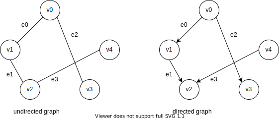
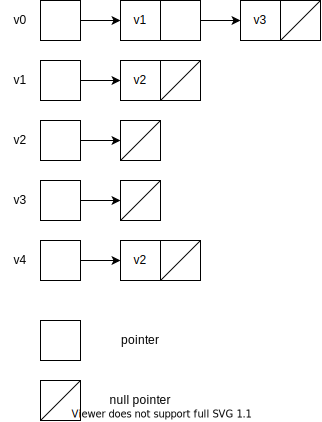
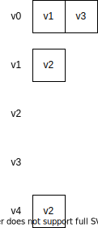

# 图的表示

## 基本概念

图$G(V, E)$有顶点（Vertex）组成的集合$V$和边（Edge）组成的集合$E$构成。

如果从边有无方向的角度上看，可以分为有向图和无向图，差不多就是车行道是否单行、双行。



例如在上图中，我们使用$e_i$表示边的长度，用$v_i$当作节点的id。

为了解释点权（顶点的属性）和边权（边的属性），用城市交通图为例，每一个城市就是图的一个顶点，城市与城市之间的公路就是边。

- 顶点的 id：就像城市都有个城市名，我们需要给顶点起一个独一无二的名字。一般来说，如果图中有 n个节点，我们一般用 0...(n-1) 来表示顶点的 id。
- 点权：即顶点的属性，比如这个城市有多大的面积，多少人口。顶点的 id 也可以说是点权，只是比较常用，所以单独列出来。
- 边长：就像公路的长度。
- 边权：即边的属性，比如这条公路限速多少。边长也可以说是边权，只是比较常用，所以单独列出来。

## 图的储存

一般来说，图的储存方式有两种：
- 邻接矩阵（Adjacent Matrix）
- 邻接表（Adjacent List）

这两种方法一般说的是对边的信息的存储。

### 邻接矩阵

该方法差不多就是使用一个二维数组来存储边的信息。

```cpp
//define edge
struct Edge {
  int len;
  //other attribution
};

Edge e[n][n];
```

用`e[u][v]`表示顶点到$u$到$v$之间的边的信息。

如果我们只需要存储边的长度，而不需要其他信息的话，直接使用`int e[n][n]`。

例如上面例子的邻接矩阵如下。

无向图

||0|1|2|3|4|
|:-:|:-:|:-:|:-:|:-:|:-:|
|0|$0$|$e_0$|$\infty$|$e_2$|$\infty$|
|1|$e_0$|$0$|$e_1$|$\infty$|$\infty$|
|2|$\infty$|$e_1$|$0$|$\infty$|$e_3$|
|3|$e_2$|$\infty$|$\infty$|$0$|$\infty$|
|4|$\infty$|$\infty$|$e_3$|$\infty$|$0$|

有向图

||0|1|2|3|4|
|:-:|:-:|:-:|:-:|:-:|:-:|
|0|$0$|$e_0$|$\infty$|$e_2$|$\infty$|
|1|$\infty$|$0$|$e_1$|$\infty$|$\infty$|
|2|$\infty$|$\infty$|$0$|$\infty$|$\infty$|
|3|$\infty$|$\infty$|$\infty$|$0$|$\infty$|
|4|$\infty$|$\infty$|$e_3$|$\infty$|$0$|

### 邻接表

差不多就是用列表来存储相邻节点。
例如上面有向图的邻接表如下。



具体实现
```cpp
struct Edge {
  int v;//id of vertex
  //other edge attribute
  Edge *next;
};

Edge* e[n];
```

更加方便的方法便是使用`std::vector`代替链表。
结构如图所示



```cpp
struct Edge {
  int v;
  //other edge attribute
};
vector<Edge> e[n];
//or
vector<vector<Edge>> e(n);
```

同样的，例如不需要存储边权的话，直接使用`vector<int> e[n]`。

#### 顶点的储存

如果需要储存顶点的点权，可以单独使用一个数据来进行储存

```cpp
struct Vertex {
  //....
};
Vertex v_w[n];
```

### 十字链表法

Orthogonal List

**待补充**