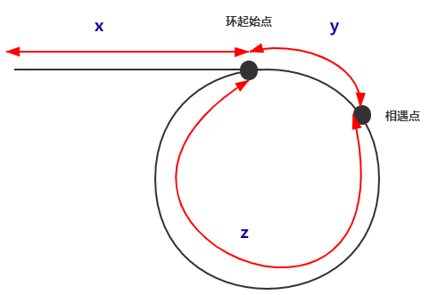

# Linked List Cycle II

- [Leetcode](https://leetcode.com/problems/linked-list-cycle-ii)
- [力扣中国](https://leetcode.cn/problems/linked-list-cycle-ii)

## Problem

## Solution

设置快慢指针，快指针每次走两步，慢指针每次走一步，由上面可以知道，快慢指针肯定会相遇。我们很容易知道快慢指针肯定在圆圈内相遇，描述图如下。

相遇时

- slow 走的路程：$x + y + n(y + z), n \in Z^+$，$n$表示 slow 绕圆圈 n 圈才相遇
- fast 走的路程：$x + y + m(y + z), m > n, m \in Z^+$，$m$ 表示 fast 绕圆圈 m 圈才相遇

由于 fast 速度是 slow 两倍，故

$$
2\left[ x + y + n(y+z) \right] = x + y + m(y + z)
$$

化简得 $x = (m -2n)(y+z) -y$，令$k = m - 2n, k \in Z^+$，则 $ x = k(y + z) - y$

- 如果 $k = 1 \Rightarrow x = z$，即 head 到环起点的距离 = 从相遇点到环起点的距离。所以，我们令其中一个指针（slow）指向 head，然后两个指针同时往后走，再次相遇时即为环起点
- 如果 $k > 1, x = t(y+z)-y = (t-1)(y+z) + z$，即 x 的长度等于 $t-1$ 圈加上 $z$。所以，我们令其中一个指针（slow）指向 head，然后两个指针同时往后走，再次相遇时即为环起点

