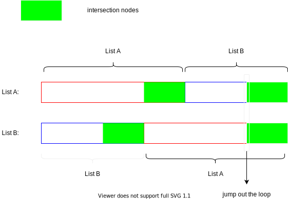

# Intersection of Two Linked Lists

- [Leetcode](https://leetcode.com/problems/intersection-of-two-linked-lists)
- [力扣中国](https://leetcode.cn/problems/intersection-of-two-linked-lists)

## Problem

## Solution

### Hash

### Double pointers

先看看两个无环单链表相交的情况，如下图所示。

如果它们存在相交的话，那么它们最后一个结点肯定是同一个结点，这是我们用来判断链表是否相交的根据。

如果我们知道两条链表的长度差 n，我们让长链表从头节点先走 n 步，然后让短链表从头节点一起走，它们相遇的点就是第一个相交点。

一种更为优雅的实现：让指针 `pA` 按照链表 A + 链表 B 遍历，让指针 `pB` 按照链表 B + 链表 A 遍历，直到两者一致。

证明：

令链表 A 的长度为 $m$，链表 B 为 $n$。

1. 情况 1：两者不相交
    - 若 $m = n$，则两个指针会同时到达两个链表的尾节点，然后同时变成空值 null，此时返回 null；
    - 若 $m \neq n$，则由于两个链表没有公共节点，两个指针也不会同时到达两个链表的尾节点，因此两个指针都会遍历完两个链表，在指针 `pA` 移动了 $m + n$ 次、指针 `pB` 移动了 $n + m$ 次之后，两个指针会同时变成空值 null，此时返回 null null。
2. 情况 2：两者相交。假设链表 A 的不相交部分有 $a$ 个节点，链表 B 的不相交部分有 $b$ 个节点，两个链表相交的部分有 $c$ 个节点，则有 $ a + c = m, b + c =n$。
    - 如果 $a = b$，则两个指针会同时到达两个链表相交的节点，此时返回相交的节点；
    - 如果 $a \neq b$，则指针 `pA` 会遍历完链表 A，指针 `pB` 会遍历完链表 B，两个指针不会同时到达链表的尾节点，然后指针 `pA` 移到链表 B 的头节点，指针 `pB` 移到链表 A 的头节点，然后两个指针继续移动，在指针 `pA` 移动了 $a + c + b$ 次、指针 `pB` 移动了 $b + c + a$ 次之后，两个指针会同时到达两个链表相交的节点，该节点也是两个指针第一次同时指向的节点，此时返回相交的节点。

