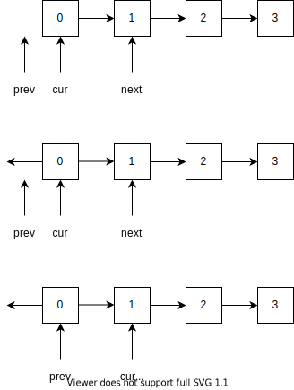
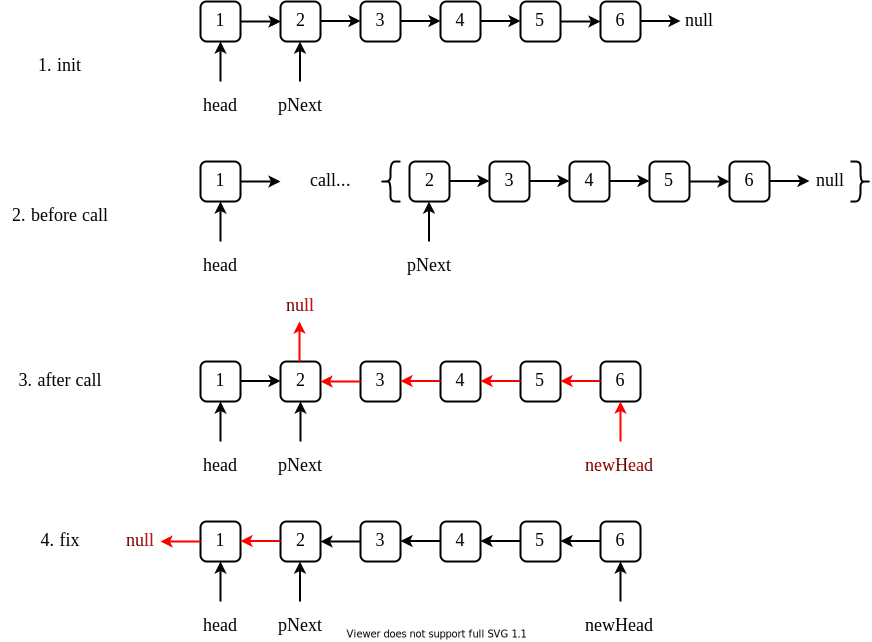

# Reverse Linked List

- [Leetcode](https://leetcode.com/problems/reverse-linked-list)
- [力扣中国](https://leetcode.cn/problems/reverse-linked-list)

## Problem

[](desc.md ':include')

## Solution

[](solution.h ':include :type=code cpp')

### Convention

[](convention.cpp ':include :type=code cpp')

将上面的步骤转化为递归写法的话，其基本思路如下

1. 将当前节点指向上一个处理当前节点
2. 递归处理下一个节点

[](convention-recursion.cpp ':include :type=code cpp')



### Recursion

上面递归版本写法其实没有用到递归函数的本质。
递归函数类似于数列的通项公式，比如知道 $a_1$ 以及 $a_n$ 和 $a_{n-1}$ 的关系，就可以（递归）求解 $a_{n}$。

例如，下面 $a_1 = 1, a_n = 4 a_{n-1}$

```cpp
int f(int n) {
  if(n == 1)
    return 1;
  else
    return 4 * f(n-1);
}
```

同理，如果定义 `ListNode* reverseList(ListNode* head)` 为反转以 `head` 为头节点的链表，同时返回反转后的链表的头节点。

如果一个链表只有一个节点（或 `nullptr`），那么直接返回这个节点。这个好比上面的 $a_1$。

那么我们只需要知道 `head` 和 `reverseList(head -> next)` 的关系（ $a_n$ 和 $a_{n-1}$）。

以反转 `1, 2, 3, 4, 5, 6` 为例子，记 `head -> next` 为 `pNext`，阐述 `head` 和 `reverseList(pNext)` 的关系。

其过程如下所示



由上图可以看出，`head` 和 `reverseList(head -> next)` 的联系可以通过修改 `head` 和 `pNext` 之间的关系来实现。

[](recursion.cpp ':include :type=code cpp')

递归版本的实现在代码上十分优雅。
