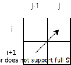
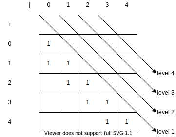

# Longest Palindromic Substring

- [Leetcode](https://leetcode.com/problems/longest-palindromic-substring)
- [力扣中国](https://leetcode.cn/problems/longest-palindromic-substring)

## Problem

## Solution

### Dynamic Programming

用 $dp[i][j](i \leq j)$ 表示子串 $s[i..j]$ 是否为回文串

$$
dp[i][j] =
\begin{cases}
1 & dp[i+1][j-1] = 1 \text{ AND } s[i] = s[j] \\
1 & i = j \\
0 & \text{other}
\end{cases}
$$

计算依赖

计算顺序：从 level 1 按箭头顺序一直计算到 level 4

### Expand Around Center

从中心两边扩展的主要思路是先确定一个中心，然后计算从这个中心向两边扩展，最大可以得到的回文串长度。
只要把所有中心都遍历了，就可以确定最长的回文子串。

