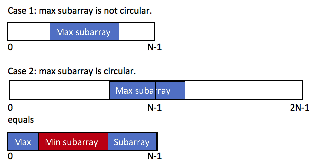

# Maximum Sum Circular Subarray

- [Leetcode](https://leetcode.com/problems/maximum-sum-circular-subarray)
- [力扣中国](https://leetcode.cn/problems/maximum-sum-circular-subarray)

## Problem

## Solution

### Dynamic Programming

最大连续子数组只有两个情况

1. 子数组没有跨越边界，子数组在数组中间
2. 子数组跨越边界

两者如下图所示

由上图，可知情况 2 相当于子数组为数组的某个头部和尾部。
这种情况下，它的和为数组和减去中间部分（子数组和最小的部分）

那么可以分别算出这两种情况的数值，取两者的最大值，即为答案。

记 $dpMax[i]$ 为以 $nums[i]$ 结尾的最大连续子数组和，$dpMin[i]$ 为以 $nums[i]$ 结尾的最小连续子数组和。
$$
maxVal = \max\limits_i dpMax[i] \\
minVal = \min_i dpMin[i]
$$

那么答案就是
$$
\max{maxVal, \sum_i nums[i] - minVal}
$$

值得注意的是，如果 $\forall nums[i] \le 0$，那么 $\sum_i nums[i] = minVal$（或者 $maxVal < 0$）。
这种情形下，情况 2 是没有意义的，只需要计算情况 1。

