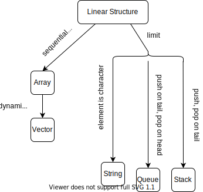

# 线性结构

线性结构是一个有序数据元素的集合。

## 特点

- 集合中必存在唯一的一个"第一个元素"；
- 集合中必存在唯一的一个"最后的元素"；
- 除最后元素之外，其它数据元素均有唯一的"后继"；
- 除第一元素之外，其它数据元素均有唯一的"前驱"。

## 分类

我们可以看出，数组是线性表的具体实现，使用顺序存储的方式，而栈和队列则是对线性表进行某些限制后的数据结构。

王道2020数据结构
数组与线性表的关系∶数组是线性表的推广。一维数组可视为一个线性表;二维数组可视为其元素也是定长线性表的线性表，以此类推。数组一旦被定义，其维数和维界就不再改变。因此，除结构的初始化和销毁外，数组只会有存取元素和修改元素的操作。

