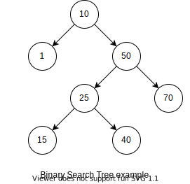
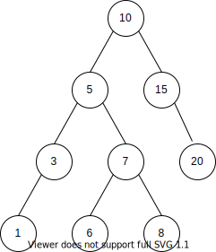
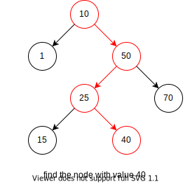
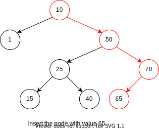
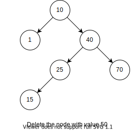
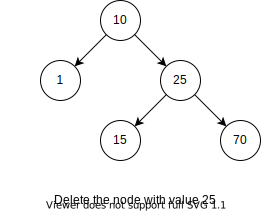

# 二分搜索树

递归定义：
1. 要么二分搜索树是空树
2. 要么二分搜索树由根节点、左右子树构成。其中左右子树都是二分搜索树，且左子树所有节点值小于根节点值，根节点值小于右子树所有节点值。



## 前驱和后继

### 定义

为了说明二分搜索树某个节点的前驱节点和后继节点，我们先看看二叉搜索树的中序遍历吧。

例如上图的例子，中序遍历的结构为 1, 10, 15, 25, 40, 50, 70。我们可以发现二叉搜索树的中序遍历的结果就是树中元素的有序排列。

- 前驱节点：节点 x 的前驱节点定义在中序输出序列中 x 的前一个元素，即前驱节点的值是小于节点 x 但并且值最大的节点
- 后驱节点：节点 x 的后继节点定义在中序输出序列中 x 的后一个元素，即后继节点的值是大于节点 x 但并且值最小的节点

### 求解

最简单的实现便是输出中序遍历序列，从该序列中查找前驱和后继结点，但这样的时间复杂度为 $\Theta(n)$

前驱结点：

- 如果 x 存在左孩子，则其左子树的最大结点便是前驱结点。如 10 的前驱结点为 8
- 如果 x 不存在左孩子
	- 如果 x 是其父节点的右孩子，其父节点为其前驱结点。如 15 的前驱结点为 10
	- 如果 x 是其父节点的左孩子，沿着 x 向上查找第一个具有右孩子的祖先且该右孩子也是 x 的祖先，则该祖先是前驱结点。如 6 的前驱结点如 5

后继结点

- 如果 x 存在右孩子，则其右子树的最小结点便是前驱结点。如 5 的后继结点为 6
- 如果 x 不存在右孩子
	- 如果 x 是其父节点的左孩子，其父节点为其前驱结点。如 6 的后继结点为 7
	- 如果 x 是其父节点的右孩子，沿着 x 向上查找第一个具有左孩子的祖先且该左孩子也是 x 的祖先，则该祖先是前驱结点。如 8 的后继结点为 10



### 实现

```cpp
template <typename T>
struct Node {
  T k;
  Node<T> *parent, *lc, *rc;
  Node(T const &key, Node<T> *father, Node<T> *plc = nullptr, Node<T> *prc = nullptr): k(key), parent(father), lc(plc), rc(prc) {}
};

template <typename T>
Node<T>* predecessor(Node<T>* x) {
  if(x -> lc) {
    x = x -> lc;
    while(x -> rc)
      x = x -> rc;
    return x;
  } else {
    Node<T> *p = x -> parent;
    while(p && x == p -> lc) {
      x = p;
      p = p -> parent;
    }
    return p;
  }
}

template <typename T>
Node<T>* successor(Node<T> *x) {
  if(x -> rc) {
    x = x -> rc;
    while(x -> lc)
      x = x -> lc;
    return x;
  } else {
    Node<T> *p = x -> parent;
    while(p && x == p -> rc) {
      x = p;
      p = p -> parent;
    }
    return p;
  }
}
```

## 代码实现

### 节点定义

```cpp
template <typename K, typename V>
struct Node {
  K k; //key
  V v; //value
  Node<K, V> *lc, *rc; //left children, right children
  Node(K const &k, V const & v, Node<K, V> *plc = nullptr, Node<K, V> *prc = nullptr): k(k), v(v), lc(prc), rc(prc){}
};
```

### 类结构

```cpp
template <typename K, typename V>
class BST {
public:
  ~BST();
  Node<K, V>* search(K const &key) const;
  void insert(K const &k, V const &v);
  bool remove(K const &k);
protected:
  Node<K, V> *_root = nullptr;

  static void free(Node<K, V> * node);
  static Node<K, V>* search(K const &k, Node<K, V> *root);
  static void insert(K const &k, V const &v, Node<K, V>* &root);
  //remove the max node from tree, and return the node
  static Node<K, V>* removeMax(Node<K, V>* &root);
  static bool remove(K const &k, Node<K, V>* &root);
};
```

### 销毁

```cpp
template <typename K, typename V>
void BST<K, V>::free(Node<K, V> * node) {
  if(!node)
    return;
  free(node -> lc);
  free(node -> rc);
  delete node;
}

template <typename K, typename V>
BST<K, V>::~BST() {
  free(_root);
}
```

## 搜索

这大概是二叉树最简单的部分，一直沿着树根向下，直到找到符合的节点（搜索成功）或者到达空节点（搜索失败）。

示例：查找值为`40`的节点，路径如红色所示



```cpp
template <typename K, typename V>
Node<K, V>* BST<K, V>::search(K const &k, Node<K, V> *root) {
  if(root == nullptr)
    return nullptr;
  else if(k < root -> k)
    return search(k, root -> lc);
  else if(k == root -> k)
    return root;
  else
    return search(k, root -> rc);    
}

template <typename K, typename V>
Node<K, V>* BST<K, V>::search(K const &key) const {
  return search(key, _root);
}
```

注意：`search`的返回值是指针，是为了方便搜索不到的时候的返回值（这时候应该返回`nullptr`），这有点类似`STL`的设计。

## 插入

插入与搜索类似，从树的根部一直往下，直到到达一个空节点或值符合的节点，把值插在这个节点。

示例：插入值为`65`的节点，路径如红色所示。



```cpp
template <typename K, typename V>
void BST<K, V>::insert(K const &k, V const &v, Node<K, V>* &root) {
  if(root == nullptr)
    root = new Node<K, V>(k, v);
  else if(k < root -> k)
    insert(k, v, root -> lc);
  else if(k == root -> k)
    root -> v = v;
  else
    insert(k, v, root -> rc);
}

template <typename K, typename V>
void BST<K, V>::insert(K const &k, V const &v) {
  insert(k, v, _root);
};
```

## 删除

步骤：

1. 找到符合的节点，若没有则删除失败
2. 将该节点的左子树的最大节点（右子树的最小节点）删除，并用最大节点（最小节点）的值替换要删除的节点的值。

对于第二步，为什么替换后，该树依旧保持二分搜索树的性质呢？

答：从大小上看，左子树的非最大节点 < 左子树的最大节点 < 根节点 < 右子树所有节点，所以用左子树的最大节点替换根节点后，新的子树依旧满足，新的左子树所有节点（左子树的非最大节点） < 新的根节点（左子树的最大节点） < 新的右子树（原来的右子树）。至于对删除节点的父节点（以及祖辈们），它们与新的子树关系没有变化，因为新的子树所有节点本来就满足与删除节点的父节点之间的大小关系。右子树的最小节点类比一下即可证明。

示例：删除值为`50`的节点（使用左子树的最大节点去代替）



如果不存在左子树的最大节点（右子树的最小节点），也就是左子树不存在右子树（右子树不存在左子树），简单地将该点删除即可。

示例：删除值为`40`的节点（在删除`50`的基础上）



```cpp
template <typename K, typename V>
Node<K, V>* BST<K, V>::removeMax(Node<K, V>* &root) {
  if(root -> rc != nullptr) {
    return removeMax(root -> rc);
  } else {
    auto ret = root;
    root = root -> lc;
    return ret;
  }
}

template <typename K, typename V>
bool BST<K, V>::remove(K const &k, Node<K, V>* &root) {
  if(root == nullptr) {
    return false;
  } else if(k < root -> k) {
    return remove(k, root -> lc);
  } else if(root -> k < k) {
    return remove(k, root -> rc);
  } else {
    auto tmp = root;
    if(root -> lc == nullptr) /* There is no left subtree of root */ {
      root = root -> rc;
    } else /* replace the node wiht max node of left subtree */ {
      auto maxNode = removeMax(root -> lc);
      maxNode -> lc = root -> lc;
      maxNode -> rc = root -> rc;
      root = maxNode;
    }
    delete tmp;
    return true;
  }
}

template <typename K, typename V>
bool BST<K,V>::remove(K const &k) {
  return remove(k, _root);
};
```

### 感悟

写写感悟吧，不得不说对于树型结构，还是使用递归写起来熟悉和快一点，下午本来想写个非递归版，在`remove`，`removeMax`和`insert`这三个函数中，需要不断维护两个指针，即父指针和待操作的节点的指针（在`remove`中为被删除的节点的指针，在`removeMax`是最大值的节点的指针，`insert`是待插入的节点的指针）。

其实，`insert`可以只维护一个指针，不需要父指针，但是需要二级指针，代码如下。

```cpp
void insert(K const &k, V const &v) {
  Node<K, V>* *curRootPtr = &_root;
  while(*curRootPtr != nullptr) {
    if(k < (*curRootPtr)->k)
      curRootPtr = &((*curRootPtr) -> lc);
    else if(k == (*curRootPtr)->k) {
      (*curRootPtr) -> v = v;
      return;
    } else
      curRootPtr = &((*curRootPtr) -> rc);
  }
  *curRootPtr = this->malloc(k, v);
}
```

不得不说，在递归中使用`*&`（注意代码中的`*&`），减少了父指针，是一种明智的选择！！

## 待补充

### 建立

1. 前序遍历序列建立二叉树

[1043 Is It a Binary Search Tree (25point(s))](https://pintia.cn/problem-sets/994805342720868352/problems/994805440976633856) 这道题没有给出序列中的空节点。

好像是我理解错了题意 [思路](https://blog.csdn.net/qq_43705697/article/details/106264671)

2. 乱序建立完全二叉树